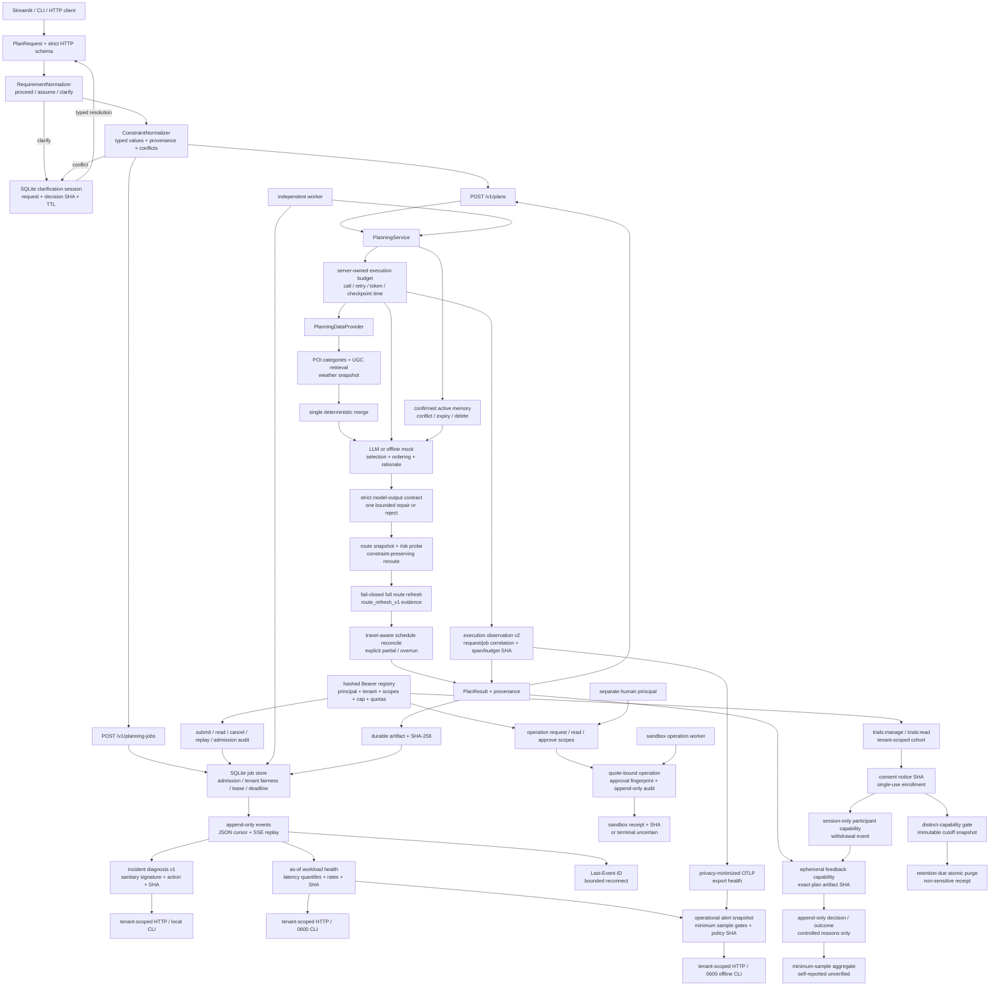

<p align="center">
  <a href="https://estelledc.github.io/bj-pal/">
    
  </a>
</p>

<p align="center">
  <a href="https://estelledc.github.io/bj-pal/"><strong>产品案例</strong></a>
  · <a href="docs/DESIGN.md">系统设计</a>
  · <a href="docs/ARCHITECTURE_EVIDENCE.md">工程证据</a>
  · <a href="docs/INTERVIEW_GUIDE.md">面试指南</a>
  · <a href="docs/INTERVIEW_MARKET_EVIDENCE.md">面经证据</a>
  · <a href="docs/EVAL_FRAMEWORK.md">评测方法</a>
</p>

# BJ-Pal：可恢复、可解释、可复现的北京短时活动规划 Agent

BJ-Pal 把一句“周末下午带孩子在北京玩四小时”的自然语言需求，转换成带时间、路线、风险、替补方案和证据来源的结构化计划。项目源自黑客松原型，当前重构目标不是继续堆 Agent 数量，而是补齐一个简历项目应该具备的工程闭环：稳定契约、数据边界、持久任务、失败语义、公开评测和可部署入口。

> 发布状态（2026-07-21）：v6.18-v6.23 已按 [PR #5](https://github.com/estelledc/bj-pal/pull/5) → [#6](https://github.com/estelledc/bj-pal/pull/6) → [#7](https://github.com/estelledc/bj-pal/pull/7) → [#8](https://github.com/estelledc/bj-pal/pull/8) → [#9](https://github.com/estelledc/bj-pal/pull/9) → [#10](https://github.com/estelledc/bj-pal/pull/10) 的依赖顺序进入公开 `main`；v6.24 的 OCI 发布链经 [PR #13](https://github.com/estelledc/bj-pal/pull/13) 合并。merge commit `a981f71` 的 [Core workflow](https://github.com/estelledc/bj-pal/actions/runs/29798787886)、[Pages 部署](https://github.com/estelledc/bj-pal/actions/runs/29798787881) 与 [OCI publish workflow](https://github.com/estelledc/bj-pal/actions/runs/29798918826) 均已通过。

本地 v6.23 follow-up 在 v6.22 的 durable-job/OTLP/告警链路之上，增加显式 CSSwitch DeepSeek 凭证交接和一次真实 provider acceptance：配置必须是当前用户持有的 regular 0600 文件、active DeepSeek/Anthropic profile、credential-free HTTPS endpoint，并且调用前显式确认费用和固定模型/预算。产物只保留 provider-reported token、耗时、契约/质量 gate 与哈希，不保留 Key、配置路径、prompt、raw output 或 plan。它仍不能证明 provider 签名身份、账单金额、线上成功率、实时 POI/路线、真实预订或用户满意度。

v6.24 把“CI 能 build Dockerfile”收敛为可验证的 OCI 发布契约：正式 tag 必须与两处代码版本一致；镜像以固定非 root UID 在只读根文件系统中通过 health、readiness、OpenAPI 和固定 synthetic plan 冒烟后，才允许推送 release/SHA/latest 三类 tag。`v6.24.0` workflow 全部通过，GHCR 返回 digest `sha256:b40f592eed1ea2407ebaecdb51f828dafc0d74679b5be68ab54564a308e4d235`，未登录的 registry manifest 请求也以 HTTP 200 返回同一 digest。该证据证明公开镜像可拉取、可启动，不等于公网 API、生产部署或 SLA。

v6.25 候选把公开容器与完整控制面拆开：镜像默认只启动 mock/synthetic public app，OpenAPI 精确保留 health、readiness 和同步 planning；provider/control credential、非 synthetic 数据或非 mock backend 任一出现即拒绝启动。原始 plan attempt 在 schema validation 前受进程级窗口、并发和 8 KiB body gate 约束，公开请求不签发 feedback capability，也不持久化 clarification continuation。真实 Uvicorn/localhost smoke 已通过；当前没有托管平台身份或长期 HTTPS URL，Cloudflare Quick Tunnel 又被本机终端策略以 SIGKILL 阻止，因此不能写成“已正式上线”。

## 一句话简历描述

> 独立重构北京短时活动规划 Agent：以 FastAPI + SQLite 构建同步规划与 durable job 双入口，将 POI/UGC/路线/天气收敛为类型化有界并行数据面；实现执行前需求门控、Constraint Ledger 与可恢复澄清会话，支持带决策指纹的 typed resolution、幂等续跑和冲突 fencing；补齐约束/路线/时间一致的局部重规划、lease/retry/dead letter、租户准入与公平调度，并从 append-only job evidence 生成隐私最小化故障签名及 closed-window workload health，复算 queue/run/terminal 延迟分位数与重试、超时、dead-letter 比率；将 request/job span 以内容默认关闭的 OTLP/HTTP protobuf 导出，再用固定样本门把 workload 与 sink health 组合为可复算告警四态，避免小样本健康假象；以服务端请求级预算限制 LLM/data/tool 调用、transport retry、provider-reported token 和安全检查点耗时；对不可信模型输出执行 strict schema/候选绑定/步骤序列校验，首次失败最多修复一次，仍越界则失败关闭；针对高风险预订实现仅限沙箱的 approval-gated operation、SHA receipt 与不确定态只读核对。

面试前应按目标岗位删减这句话，不建议把所有技术名词一次塞进简历。可选版本见 [面试指南](docs/INTERVIEW_GUIDE.md)。

## 当前能证明什么

| 能力 | 本地可复算证据 | 边界 |
|---|---|---|
| 从零运行 | `make bootstrap-demo` 生成数据 manifest 和 SQLite；`make check` 跑测试、API/job smoke、CLI、展示站与公开评测 | 默认数据是 synthetic |
| 统一业务主链 | Streamlit、CLI、同步 HTTP、durable worker 共用 `PlanRequest → PlanningService → PlanResult` | 控制面身份仍是静态本地 registry，不是外部 IdP |
| 执行前需求门控 | `requirement_gate_v1` 区分直接执行、透明默认假设和必须澄清；同步 API 与 durable submit 在任何 Planner/tool fan-out 前共同拦截 | 20 条 hand-authored synthetic case；不是开放域语义理解或真实用户澄清满意度 |
| 自然语言约束不漂移 | `constraint_ledger_v1` 将人数、儿童、忌口、步行半径、人均预算、开始时间、时长和人群映射到 typed preferences；保留文本证据、字段来源、rewrite 与合并结果，文本/显式字段冲突时 409 | 30 条 hand-authored synthetic case 全指标 1.000；只覆盖已声明字段和高精度中文规则，不是开放域 NLU |
| 澄清后从原请求续跑 | 409 同时持久化原请求、decision/options、resolution、resolved request 与结果的 SHA-256 链、TTL 和 delivery policy；调用 `continue_url` 产生 `clarification_resolution_v1`，同步结果缓存、job 内部幂等，Streamlit/CLI 可原地继续 | 16 条 hand-authored synthetic case 的一步续跑、有效值、完整性链、恢复、重放与冲突 fencing 全通过；单机 SQLite、capability ID、无真实多轮满意度；TTL 到期后结果也不可重放 |
| 数据面隔离 | POI/UGC/路线/天气通过类型化 provider 契约暴露；独立读取、单点合并 | POI/UGC/路线仍是 SQLite；天气 live 模式尚无本项目商业授权验收 |
| 天气 Provider | Open-Meteo typed adapter 覆盖有界 timeout、429/5xx/schema taxonomy、进程级 TTL cache、stale-if-error、attribution；Planner 与 Probe 共享同一快照 | 默认是明确标注的 synthetic fixture；live smoke 不进入公开 CI，也未在本次运行执行 |
| 约束保持型 Replan | 替换前按 step kind/reason 执行硬过滤：正餐不能降级为咖啡/小吃，雨天户外跨类切室内；事件保存候选数量、来源类目和策略版本 | 仍是小型确定性规则；没有真实 reroute 接受率或开放域语义模型 |
| Replan 路线一致性 | 成功换点后先清空旧 leg，再重算完整短路线；`route_refresh_v1` 保存受影响站位、缓存/估算来源和降级 warning | 不是实时路况；缺坐标或查询失败时保留空路线并显式降级 |
| 路线感知时间轴 | `start_time` 按到站时间级联计入路程；超窗时按版本化最小停留策略压缩柔性时长，仍放不下则返回 `overrun` | 不自动删站；未知路线会把 schedule 标为 `partial` |
| 查询证据检索 | 领域词扩展、字段加分和 POI 去重全部可解释；19-case synthetic golden set 同时跑 legacy/candidate | Macro Recall@5 0.974→1.000；不代表真实评论或线上准确率 |
| 用户记忆生命周期与独立存储 | 正常规划只读；显式入口写入 source/confirmation/expiry/revision；冲突、忘记和删除有确定性语义。`user_memory + user_memory_events` 作为同一领域成对迁移，显式 receipt 通过后所有读写与隐私删除只进入 `runtime/user_memory.db` | 本机非破坏迁移 2,783 state + 5,572 event；4-case synthetic artifact 九项 rate 全 1.000。旧行仍保留；无服务端身份、加密、跨设备同步或备份擦除证明 |
| 失败可诊断 | HTTP 结构化错误；provider 部分失败单独记录；retry/dead-letter/timeout 与 append-only event 同事务落库；`GET /v1/planning-jobs/{job_id}/diagnosis` 和本地 CLI 从完整 tenant-scoped event chain 生成 14 类版本化故障签名、处置建议、阶段耗时与双 SHA-256，未知错误码只保留 `unclassified_error` | 14 类 hand-authored synthetic contract 全通过；分类器只报告持久证据支持的 signature，不是根因分析、生产 incident 数据或真人结果；超过 1,000 个事件时拒绝截断；deadline 不会强杀已阻塞的外部调用 |
| Workload 健康可复算 | `GET /v1/planning-job-health` 与 0600 CLI 对单 tenant、最长 31 天的闭合 `[start,end)` 窗口聚合固定 status 分母、nearest-rank queue/run/terminal p50/p95/p99、重试/lease/timeout/dead-letter/cancel 比率和双 SHA；空窗口比率为 `null` | 2 个 fixed synthetic window 与独立 verifier 当前全通过；最多 1,000 job/10,000 event，超限拒绝截断；不输出 tenant/principal/request/job/worker/payload/error；这是可复算快照，不是 OTLP、生产 SLO、容量结论或事故率 |
| 运行告警不把小样本当健康 | `GET /v1/operational-alerts` 组合 integrity-checked workload 与 payload-free trace status；failure/queue/retry 各有 20 样本门，规则与总状态只允许 `firing/healthy/insufficient_data/disabled`，并绑定 source/policy/artifact SHA；离线 CLI 只读已有 source 并创建 0600 工件 | 4 个 authored synthetic case 与独立 verifier 全通过；fixed threshold 和单 snapshot 不是生产 baseline/SLO，也没有连续窗口、迟滞、Alertmanager delivery、事故处置 outcome 或多实例证据 |
| 断线不丢任务 | 请求先写 durable job，worker claim 后定期 heartbeat；过期 lease 可 fenced/reclaim，结果持久化为带 SHA-256 的 artifact | 默认单机 SQLite；无多实例队列或真实副作用 receipt |
| 优先任务与租户间公平性 | `tenant_fair_priority_aging_v2` 先按 `priority_aging_v1` 计算有效优先级，再在同优先级内选择最久未获服务的 tenant，最后按 eligible-time FIFO；claim event 保存全部选择依据，4-case artifact 独立重算 | 高优先级仍先于低优先级，不是严格全局公平或启动 SLA；新 tenant 会先获得一次机会；无在线 reprioritize、多实例队列或吞吐保证 |
| 事件可回放 | heartbeat/retry/dead-letter/cancel/timeout 与状态同事务追加；JSON cursor 和 SSE 共用事件表，`Last-Event-ID` 可续读 | SSE 是最长 30 秒的有界投影；无多实例事件存储 |
| 任务可控制且隔离 | 静态哈希凭证映射到 principal/tenant；scope、priority cap 和 tenant namespace 均 fail closed；`tenant_admission_v1` 在同一 SQLite 写事务内限制 active job 与 60 秒 accepted-submission 窗口，拒绝/准入/幂等复用均写 tenant-scoped append-only audit；6-case artifact 从原始 HTTP 结果独立复算 | 不是 OAuth/OIDC、数据库 RLS 或动态 IAM；没有凭证生命周期、跨实例全局配额、audit retention/storage-DoS 防护、加密或主动中止单次 provider 调用 |
| 高风险副作用先审批 | `approval_gated_operation_v1` 将餐厅预订动作、报价 reference/有效期/金额/条款 hash 与 approval fingerprint 绑定；请求者不能自批，tenant 内幂等，独立 worker 只执行已批准且未过期 operation；成功保存与 operation/request/provider/outcome 绑定的 SHA receipt | 只允许 `bj-pal-sandbox`，没有真实供应商调用、补偿、客服 handoff、签名回执或 PII/secret 生产治理 |
| 不确定执行不盲重试 | provider 调用后不明时进入 `uncertain` 且不自动重放写操作；`operations:reconcile` 只能用持久化 provider operation ID 发起只读查询，严格核对 operation/request/provider/reference 与 raw payload SHA，再追加 reconciliation 证据并解析为成功、失败或继续不确定 | 当前查询仍是确定性 sandbox；lease 过期且没有 provider reference 时必须人工处置，不能自动“猜成未下单” |
| 用户结果不与 synthetic 混写 | `/v1/plans` 为最终 plan artifact 发放限时 capability；decision/outcome 分阶段、每个 artifact/phase 只追加一次，令牌只存 SHA，原因只允许枚举；公开比例在每阶段至少 5 份前返回 `null` | 当前仓库只有 4-case synthetic contract 证明机制，不包含真实用户报告；`self_reported_unverified` 不是满意度、任务成功率或逐步 confidence calibration |
| 知情试用分母可审计 | `trial_consent_notice_v1` 固定用途/字段/退出/保留说明；operator 按 tenant 签发单次加入码，参与者只在精确 notice SHA 上同意；每个参与凭证每 phase 最多一条，退出者从未冻结汇总排除，关闭批次生成 cutoff-bound snapshot | 不采集姓名或账号，也就不能证明不同凭证一定来自不同真人；当前真实试用参与者与 report 仍为 0 |
| 真实试用操作不靠手写 SQL | `scripts/manage_trial.py` 支持 create/issue/status/close/purge；批量加入码同一事务签发，只写入新建的 mode-0600 gitignored bundle，stdout 不回显；关闭和到期清除都需精确复述 trial ID，清除另需 secret/backup disposition 明示确认 | 清除只允许已冻结且到期的 cohort，在 `DELETE/TRUNCATE` journal mode 下启用 SQLite `secure_delete` 并原子删除目标行、恢复触发器、检查外键、写防篡改收据；这不是远程 IAM、托管调度、取证级擦除或备份删除证明，真实招募仍未发生 |
| 就绪失败关闭 | `/readyz` 校验 manifest、SQLite quick check、必需表、metadata 和精确行数 | 只覆盖当前本地数据 profile，不等于外部 provider 健康 |
| 行为回归 | L1/L2/L3 公开 mock 套件保存 raw cases、运行环境、数据 profile 和双 SHA-256，并由独立 verifier 复算 | 不是线上质量、业务转化或真实用户成功率 |
| 并发回归证据 | `/v1/plans` 用有界共享数据执行器；整份 plan trace 单事务替换；tool log session 使用 request-local context；进程内 ASGI 与独立 Uvicorn/localhost TCP 两条 benchmark 均保存逐请求延迟、状态和 request ID，并由同一独立 verifier 复算 | socket 工件强制 `127.0.0.1`、临时 runtime、无 provider/control 凭证子进程和优雅退出；仍是单机单进程、mock/synthetic，无 TLS/反向代理、多实例或生产 SLA |
| 执行观测可校验 | 每次 canonical `PlanResult` 返回 `execution_observation_v2`：request/job correlation、父子 span、阶段耗时、LLM/data/tool 调用数、业务计数、服务端预算快照与双层 artifact SHA；独立 verifier 重算树、汇总、token 语义和敏感标记排除 | 内存 capture 与外部 exporter 相互独立；未覆盖多实例；provider 不回报 token 时明确为 `unavailable`，不估算成本 |
| OTLP 导出默认最小化 | `BJ_PAL_TRACE=otlp` 通过标准 OTLP/HTTP protobuf batch exporter 发送 span；只允许随机 execution ID、低基数运行属性、`gen_ai.operation/provider/usage` 与稳定 error type；`GET /v1/trace-export-status` 复用 `jobs:read` 且只返回 endpoint origin SHA/计数/状态 | 2-case synthetic protocol artifact 用本机 loopback collector 解码真实 protobuf 并注入 exporter 失败；不保存 session/user/location/prompt/tool args/decision/error 正文；不是远端 vendor、生产投递、持续告警、SLO 或真实流量证据 |
| 工具日志不直接落任意 payload | `tool_call_audit_v2` 对 params/response 做有界结构投影；异常只留稳定 code，每个 session 形成 SHA-256 链，v2 行拒绝 UPDATE/DELETE；新事件默认只写独立 `runtime/tool_audit.db`，socket benchmark 也重定向到临时库，足迹聚合只读 v2 行 | 5-case synthetic artifact 只覆盖固定攻击样本与本地库隔离；旧共享 `tool_calls.db` 不自动复制、重写或擦除；新库仍未加密、未远端不可变，operator 可删除整文件 |
| Plan evidence 有独立 owner | `state_layout_v1` 将 `plan_trace + plan_outcome + calibration join` 绑定到独立 `runtime/plan_evidence.db`；现有安装先读 legacy，只有显式 copy 的 count/hash/receipt/quick-check 全通过后切换；HTTP/TCP benchmark 均用临时证据库 | 本机已非破坏迁移 75,022 trace + 1,312 outcome，旧库未删；3-case synthetic artifact 六项 rate 全 1.000。它不是 RLS/加密/远端迁移 |
| Prediction feedback 有独立生命周期 | 通用 verified-copy 内核按领域描述复用 count/logical SHA、receipt、quick-check、0600 atomic publish 与 WAL fail-closed；`prediction_log` 迁移后继续支持 prediction INSERT、actual UPDATE 与定向 DELETE，新写入不再进入共享库 | 本机已非破坏迁移 33,791 行，其中 11 行有 actual；4-case synthetic artifact 七项 rate 全 1.000。旧行仍保留，单机 SQLite 不是在线双写、加密、RLS 或远端不可变审计 |
| 旧共享库回退可在部署时失败关闭 | `audit_legacy_retirement.py` 只输出表计数、库名和稳定状态；核对已知表集合、三类 receipt/source snapshot、resolver、专用库完整性和 tool-audit owner。设置 `BJ_PAL_STATE_LAYOUT_POLICY=dedicated_required` 后 `/readyz` 对 legacy fallback、source drift、未知表或 receipt 丢失返回 not-ready | 真实本机 18 项 retirement audit 与 strict readiness 全通过；4-case synthetic artifact 五项 rate 全 1.000。旧行仍保留，本机制不是在线迁移、备份删除、加密或静态代码的形式化 owner 证明 |
| 发布候选边界可逐文件复核 | `make audit-release-candidate` 从 NUL 分隔 Git porcelain 生成 payload-minimized manifest，按实现/文档两组记录相对路径、状态、大小、Git 可执行位和 SHA-256；独立 verifier 重新读取工作树、Git HEAD/分支/远端分歧和策略后复算 | 当前绑定 333 项（315 实现、18 文档），60 modified + 273 untracked，0 违规；repository owner 已确认旧 LongCat Key 在 provider 侧撤销，但只有 owner attestation、没有 provider 签名回执；manifest 仍不能替代 credential history 审计、远端 CI 或人工 code review |
| 执行预算可终止 | `execution_budget_v1` 由服务端配置，默认限制每次规划最多 2 个逻辑 LLM call、1 个 data batch、8 个 instrumented tool call、每 LLM call 4 次 transport attempt、32768 个 provider-reported token 和 120 秒安全检查点耗时；N+1 在进入操作前拒绝，429/job terminal failure 返回带 SHA 的非敏感终止快照；6-case verifier 独立复算 | wall-clock 只在安全检查点生效，不能强杀已经阻塞的网络调用；token 只在 provider 回报后可检查，已经消耗的 token 无法追回；不是金额预算、分布式 quota 或生产 billing 证据 |
| 模型输出越界会失败关闭 | `model_output_contract_v1` 在构造 `Plan`、查询路线或写 trace 前执行 strict schema、精确 persona/area、候选 ID/名称、去重、depart 与时间序列校验；`meal/snack` 还必须绑定 food 类候选，不能把景点伪装成餐饮绕过忌口降级；首次失败最多调用同一 provider 修复一次，第二次失败返回脱敏 hash 快照 | 13 条 hand-authored adversarial payload 与 4 条 deterministic lifecycle case 全通过；只证明契约和预算边界，不代表真实模型错误分布、修复质量、方案可用性或用户满意度 |
| 真实配置模型坏例、修复与小型 live 质量代理可复核 | 历史 5 份 DeepSeek observation 保留 Flash 坏例、同场景 Flash/Pro 选型与第一轮 3-case acceptance；v6.10 在修复 798 候选覆盖和证据型忌口过滤后重新运行 3 个 Pro 场景，并分别保存脱敏 observation 与 plan projection。独立 verifier 从 POI facts、路线、时间轴和固定 policy 复算三里屯 9/9、五道营家庭 12/12、798 单人 11/11 个必需检查，0 项不可评估 | 新三例仍各只运行 1 次；798 经一次模型修复后才通过。检查使用 synthetic POI/UGC/路线与确定性代理，不评判 rationale、真实 freshness 或用户偏好；provider 不是 signed receipt，不能外推成功率、满意度、生产质量或金额成本 |
| 真实 provider 凭证交接与 usage/质量证据绑定 | `run_live_provider_acceptance.py` 仅在显式费用确认下读取 active CSSwitch DeepSeek profile；拒绝 symlink、非 owner、group/other 可读、非 HTTPS、隐式模型和覆盖已有目录。2026-07-21 固定三里屯场景一次调用首轮通过，1 个 LLM call 实报 53 input + 1411 output = 1464 token，执行约 28.9 秒；三份 0600 工件 Key 精确命中为 0，独立 verifier 重算 observation/quality/budget/acceptance 多层 SHA 和六项 gate | 单次 operator observation，不是成功率或延迟分布；configured model/provider 不是签名回执；token 是 provider 经配置 client 回报，不是发票或币种成本；CSSwitch 本地交接不等于服务端轮换/过期/撤销、KMS 或多租户金额预算 |
| 编排选型有对照证据 | 旧 ToT 被收紧为最多 3 个同构 planner 分支并显式继承请求 budget/trace；3-case synthetic 对照从 raw plan、规则分解和 budget snapshot 复算单分支与多分支的质量、调用、数据批次、耗时与故障注入 | deterministic mock 忽略 branch hint：当前质量提升率和输出变化率均为 0，LLM/data 调用均为 3 倍，因此主链保持单分支；这不是对真实模型或全部多 Agent 架构的普遍结论 |
| OCI 发布失败关闭 | `vMAJOR.MINOR.PATCH` tag 必须匹配 package/service version；固定 UID 10001 镜像在只读 rootfs、临时 runtime/tmp、cap-drop 与 no-new-privileges 下通过 health/readiness/OpenAPI/fixed synthetic plan 后才登录 GHCR；发布 release/SHA/latest tag 并记录 digest | `v6.24.0` 已在 GitHub runner 全链通过，匿名 manifest HTTP 200 且 digest 与 workflow 一致；单次 amd64/mock/synthetic container acceptance 仍不代表公网 API、TLS、多实例或 SLA |
| 公网 demo 与内部控制面隔离 | `http_api.public_app` 启动时强制 mock + public synthetic data 且拒绝 provider/control credential；OpenAPI 只注册 health/readiness/sync plan；raw attempt、并发和 body 在 planner 前限流，计划不写 feedback/clarification state | 新增定向测试与真实 localhost Uvicorn smoke 已通过；aggregate limiter 只在单进程生效，不信任 proxy identity；当前无长期 HTTPS URL、TLS 平台回执、多实例或 SLA |

更细的“主张 → 代码 → 测试 → 限制”映射见 [工程证据地图](docs/ARCHITECTURE_EVIDENCE.md)。

## 系统主链



核心取舍：

- LLM 负责意图理解、候选选择、顺序和解释；POI 候选、路线估算、预算过滤、风险规则、状态转移和 artifact 校验由程序控制。
- Requirement Gate 只对无法解析的历史/序号指代、相对位置缺上下文和片区冲突追问；普通缺省请求记录可覆盖默认值后继续，避免把“多问”误当准确。
- Constraint Ledger 只抽取当前 Planner 真正能执行的 typed 字段；结构化控件与文本匹配时对账、忌口取安全并集、硬约束冲突时追问，原始文本和调用方 `provided_fields` 均不被改写成伪造来源。
- 澄清不是无状态错误字符串：服务保存原请求、选项、delivery/deadline/priority policy 和决策指纹，答案生成不可变 typed resolution；相同答案可重放，不同答案返回冲突，多项冲突逐层续接且旧 continuation 始终指向同一个下一问。
- 局部重规划先执行 `constraint_preserving_replan_v1` 硬过滤，再做排序；流程成功但活动语义错误仍算失败。
- 换点会同时改变进入该站和离开该站的路线；系统重算整份短路线并先清除旧字段，失败时返回 warning 而不是沿用陈旧 leg。
- `start_time` 是到站时间；路线刷新后按 `previous start + dwell + incoming travel` 级联重排，在明确最小停留下压缩柔性时长，不能满足时间窗口时显式 `overrun`。
- 候选分支返回独立结果，再由一个节点合并；不让并行任务写同一个可变全局状态。
- Planner 不自动沉淀记忆；未确认、过期或 forgotten 的内容不能进入 prompt，用户可执行永久删除。
- SSE 只投影 durable event；流式连接断开不会取消 job，客户端用 `Last-Event-ID` 从 SQLite 游标续读。
- durable scheduler 只在 `available_at` 后开始 aging；0-9 基础优先级每 60 秒升一级并封顶 9。有效优先级相同后，先选 `last_claimed_event_id` 最小的 tenant，再做 eligible-time FIFO；它约束单机选择顺序，不承诺 worker 何时启动。
- durable job 的 tenant/principal 与准入策略由服务端凭证 registry 决定，不接受调用方自报 header；HTTP 查询、事件、取消、重放、job continuation、幂等键和 admission audit 均在 tenant namespace 内。新提交、重放和澄清恢复在一个 `BEGIN IMMEDIATE` 事务里检查 active/accepted-submission 配额；匹配的幂等重试复用原 job，不被配额误拒。
- 预订不是普通 job 的“最后一步”：operation 将精确 action + quote + policy 绑定到 approval SHA，请求者与审批者必须是不同 principal；执行后保存 receipt，调用后结果不明进入 `uncertain` 且不自动重试，避免重复下单。
- lease 约束 worker ownership，deadline 约束整项任务生命周期，HTTP/SSE timeout 只约束一次连接；三者不是同一个超时。
- execution budget 约束一次 `PlanningService.execute` 的逻辑 LLM/data/tool fan-out、每次 LLM transport retry 上限、provider 实报 token 和安全检查点 wall-clock；它不接受客户端逐请求改写，预算终止对同步 HTTP 是结构化 429，对 durable job 是不重试的 terminal failure。已经进入阻塞网络调用后仍依赖 provider timeout，不能被 Python 检查点主动强杀。
- 模型输出始终是不可信输入：只有 exact schema、请求 persona/area、候选 ID/名称和步骤序列全部通过，才允许构造 `Plan` 并进入路线/trace；第一次失败最多用剩余 request budget 修复一次，第二次失败以 `invalid_model_output` 终止，不做本地字段丢弃、类型强转、去重或残缺 JSON 自动放行。
- `evidence_support_v1` 是可解释支持度，不是成功概率；只有与真实 outcome 配对后才有资格讨论 ECE。
- plan-level 用户反馈与 step-level calibration 是两类证据：前者只能描述自报采纳/完成，不能反推每一步支持度是否校准；旧 seed outcome 现被标为 `synthetic_test`，不会进入真人逐步校准面板。
- 未分组 feedback 与试用批次严格分开：试用指标只读取显式 cohort 绑定的记录，并按不同参与凭证计数；这比按 report 计数更难被重复方案污染，但没有外部身份核验时仍不能声称“5 位不同真人”。
- retention 到期不是自动删除：受信 operator 只能对已冻结 cohort 发起精确确认的本地 purge；排他事务内验证 snapshot/hash、删除目标 trial 行、恢复 append-only trigger、检查外键并留 receipt。`secure_delete` 仍不等于外部备份或取证级擦除证明。
- `request_id`、`job_id`、`plan_id`、`artifact_id` 分开，避免用一个 ID 同时承担追踪、业务和恢复语义。
- 新执行用 request/job correlation 关联 span tree；公开 observation 不保留 prompt/用户输入，provider 未回报 token 时保持 `unavailable`，不生成虚构 token 或金额成本。LongCat/DPSK 由应用层单独持有 retry，SDK retry 被关闭，避免两层重试相乘。

## 快速运行

要求 Python 3.11+。

```bash
make setup
make bootstrap-demo PYTHON=.venv/bin/python
make check PYTHON=.venv/bin/python
make eval-job-diagnostics PYTHON=.venv/bin/python
make verify-live-model-observation PYTHON=.venv/bin/python
make verify-live-plan-quality PYTHON=.venv/bin/python
make verify-live-provider-acceptance PYTHON=.venv/bin/python
```

查询作业诊断不需要读取 request payload 或原始异常文本；HTTP 复用 `jobs:read` 与 tenant namespace，本地 operator CLI 要求显式给出 job/tenant，输出文件只允许新建且权限为 0600：

```bash
curl -H "Authorization: Bearer $BJ_PAL_CONTROL_TOKEN" \
  http://127.0.0.1:8000/v1/planning-jobs/job-.../diagnosis
.venv/bin/python scripts/diagnose_job.py \
  --job-id job-... --tenant-id tenant-alpha --output /tmp/job-diagnosis.json
```

诊断结果中的 `runtime_or_dependency_unknown` 只表示持久化边界无法继续区分；必须先检查依赖健康和受控 replay 条件，不能把它改写成数据库、模型或网络的确定根因。

已有历史 `tool_calls.db` 时，先只读预演，再由 operator 显式确认迁移；目标库已存在时命令会失败，不会覆盖，也不会删除旧库：

```bash
.venv/bin/python scripts/migrate_plan_evidence.py
.venv/bin/python scripts/migrate_plan_evidence.py --apply --confirm-domain plan_evidence
.venv/bin/python scripts/migrate_prediction_feedback.py
.venv/bin/python scripts/migrate_prediction_feedback.py --apply --confirm-domain prediction_feedback
.venv/bin/python scripts/migrate_user_memory.py
.venv/bin/python scripts/migrate_user_memory.py --apply --confirm-domain user_memory
.venv/bin/python scripts/audit_legacy_retirement.py --require-ready
make audit-release-candidate PYTHON=.venv/bin/python
```

默认 `make check` 只离线复核已脱敏的 live observation、plan-quality projection 与 v6.23 acceptance receipt，不发起外部调用。普通复跑仍可显式配置 `DPSK_*` 后使用 `make live-model-smoke ACK_PROVIDER_COST=1`；需要从本机 CSSwitch active DeepSeek profile 做安全交接时，使用 `make live-provider-acceptance ACK_PROVIDER_COST=1 LIVE_PROVIDER_OUTPUT_DIR=<全新目录> LIVE_PROVIDER_MODEL=deepseek-v4-pro PYTHON=.venv/bin/python`。后者只在显式 opt-in 时读取配置，拒绝不安全权限、symlink、隐式模型和覆盖已有目录；Key 只进入进程内 provider 环境。固定场景和单样本仍不能支持成功率、延迟优势或币种成本结论。

`make check` 包含：当前 index + non-ignored untracked tree 的 credential-like literal 扫描、pytest、同步 HTTP smoke、durable job/event/diagnosis smoke、审批式沙箱 operation smoke、离线端到端 demo、澄清续跑与知情试用生命周期排练、showcase 构建、行为评测 artifact、UGC 检索 baseline、20-case 需求门控评测、30-case 约束账本评测、16-case 澄清续跑评测、3-case 执行观测契约、14-case durable-job diagnosis 契约、2-case durable workload health、2-case OTLP loopback/failure 协议验收、4-case operational alert contract、5-case 工具调用日志隐私/完整性/存储隔离契约、3-case plan-evidence 迁移契约、4-case prediction-feedback 迁移/续写契约、4-case user-memory 成对迁移/隐私删除契约、4-case legacy-retirement 失败关闭契约、6-case 执行预算契约、13+4-case 模型输出失败关闭契约、历史 live observation/pair/suite、v6.10 3-case plan-quality suite 与 v6.23 单次 live-provider acceptance receipt 的离线复核、3-case 编排选型对照及故障/预算边界、4-case durable 调度契约、6-case 访问控制/准入契约、5-case 副作用安全契约、4-case 用户结果证据契约、6-case 知情试用证据契约、天气契约 artifact，以及进程内 ASGI 和独立 localhost TCP 两条有界 HTTP 并发回归。`make audit-release-candidate` 是只适用于 dirty worktree 的独立提交前门，不进入 clean-checkout CI；credential 扫描和 manifest 都不读取 Git 历史，也不能撤销已泄露的凭证。

最近一次本机完整验证（2026-07-21）：v6.23 follow-up tree 的 credential-like literal 扫描覆盖 557 个 index + non-ignored untracked 文件并通过，注入样本会失败且不回显值；903 条 pytest 用例中 900 passed、3 条 `real-cache` 专用用例 skipped；API/job/operation/reconciliation smoke、普通/澄清 CLI、知情试用排练、operator CLI help、showcase 29/29、L1 5/5、L2 25/25、L3 100/100、19-case retrieval、20-case requirement、30-case constraint、16-case clarification、3-case observability、14-case durable-job diagnosis、2-case durable workload health、2-case OTLP loopback/failure protocol acceptance、4-case operational alert contract、5-case tool-call audit、3-case state-layout、4-case prediction-state、4-case user-memory-state、4-case legacy-retirement、6-case execution budget、13+4-case model-output contract/lifecycle、历史 live-model observation/pair/suite、v6.10 3-case plan-quality suite、新增 v6.23 单次 live-provider acceptance receipt、3-case orchestration comparison 及故障/预算边界、4-case scheduling、6-case access control/admission、5-case 副作用安全契约、4-case 用户结果证据契约、6-case 知情试用证据契约、天气契约 artifact，以及进程内 ASGI 和独立 localhost TCP 两条有界 HTTP 并发回归均通过。首次完整门禁发现 OTLP artifact verifier 仍硬编码 v6.22，已改为从 `pyproject.toml` 读取声明版本并由版本一致性测试约束；修复后完整门禁退出码为 0。最终 `main` 的 [Ubuntu Core workflow](https://github.com/estelledc/bj-pal/actions/runs/29796656281)（含 Docker build）与 [Pages 部署](https://github.com/estelledc/bj-pal/actions/runs/29796656267) 也已通过；v6.18 的 333 项 release-candidate manifest 是当时发布前 dirty-tree 边界，不作为当前 clean `main` 的文件计数。

本轮进程内 ASGI benchmark 20/20 成功、0 个 request ID mismatch（6.95 rps、p50 564.06ms、p95 676.81ms）；独立 Uvicorn/localhost TCP acceptance 同样为 20/20、0 mismatch（启动 583.82ms、7.25 rps、p50 515.90ms、p95 703.17ms）。二者都是单次本机 mock/synthetic 观测，不用于比较优劣或声称 SLA。v6.19 diagnosis 的 14 类 signature/action、v6.20 workload health 的 aggregate/latency/privacy、v6.21 OTLP 的 protocol/privacy/health/isolation、v6.22 operational alert 的 decision/sample-gate/source-binding/privacy 及 v6.23 live-provider acceptance 的六项检查均通过；v6.10 live plan-quality 三例分别通过 9/9、12/12、11/11 个必需检查，0 项不可评估；v6.13 tool-call audit 与 v6.14 state-layout 各六项、v6.15 prediction-state 七项、v6.16 user-memory-state 九项、v6.17 legacy-retirement 五项固定指标均为 1.000。默认真实 participant/report 仍为 0。

v6.24 本机完整门禁另收集 913 条 pytest：910 passed、3 条 `real-cache` 专用用例 skipped；凭证扫描覆盖 563 个当前树文件；API/job/operation、全部离线 verifier、showcase 29/29 与两条 20/20 HTTP 性能回归均通过。发布候选审计为 17 个文件、0 违规；远端 `main` Core、Pages 与 OCI publish 也全部成功。

v6.25 候选的完整 `make check` 通过时收集 927 条 pytest：924 passed、3 条 `real-cache` 专用用例 skipped；之后补齐并发占满、直接配置越界、v6.24 smoke 兼容和动态 container healthcheck 测试，最终全量 pytest 为 931 passed、3 skipped，17 条 public-demo 定向测试与 v6.25 独立 Uvicorn/localhost smoke 也通过。凭证扫描覆盖 568 个当前树文件，19 个发布候选文件（13 实现、6 文档）为 0 违规；本机 Docker daemon 不可用，容器 build 仍需远端 Core CI 验证。

这些结果仍不代表 Git 历史无泄露、真实模型幻觉分布/修复率、真实用户结果、真人身份、真实供应商、外部 IdP、动态 RBAC、数据库 RLS、跨实例配额/金额预算、主动强杀阻塞调用、取证级擦除或生产容量。v6.24 公开镜像已可匿名读取 manifest，但可拉取镜像不等于公网 API 或生产部署。Open-Meteo live smoke 未执行。

### 启动 Streamlit

```bash
BJ_PAL_LLM=mock .venv/bin/python -m streamlit run src/ui/app.py
```

### 启动 HTTP API

```bash
# 兼容模式，仅供本机单管理员演示；真实环境优先使用下文的哈希 registry。
export BJ_PAL_CONTROL_TOKEN='local-demo-control-token-change-me-123456'
make api PYTHON=.venv/bin/python
```

也可以用公开 mock/synthetic 镜像在本机启动；默认只绑定 loopback，运行期数据库放在易失 tmpfs：

```bash
docker pull ghcr.io/estelledc/bj-pal:v6.24.0
docker compose -f compose.public.yaml up -d
.venv/bin/python scripts/smoke_deployed_api.py \
  --base-url http://127.0.0.1:8000 \
  --expected-version 6.24.0
```

完整的 tag/version、hardening、冒烟、digest 和限制契约见 [`docs/CONTAINER_RELEASE.md`](docs/CONTAINER_RELEASE.md)。复现时应优先绑定 release tag、SHA tag 或 digest，不依赖可变的 `latest`。

```bash
curl http://127.0.0.1:8000/healthz

curl -X POST http://127.0.0.1:8000/v1/plans \
  -H 'Content-Type: application/json' \
  -H 'X-Request-ID: demo-sync-1' \
  -d '{
    "user_input": "周末下午带 5 岁孩子在五道营附近玩四小时，不吃辣",
    "persona": "family",
    "preferences": {
      "party_size": 3,
      "has_child": true,
      "child_age": 5,
      "diet_flags": ["no_spicy"],
      "duration_hours": 4
    }
  }'
```

OpenAPI 文档位于 `http://127.0.0.1:8000/docs`。

### 处理 409 后继续原请求

当请求需要澄清时，响应中的 `error.details.continuation` 会给出有 TTL 的 capability ID、typed options 和 `continue_url`。客户端不需要重新拼装原始请求：

```bash
# 假设第一次 /v1/plans 返回的选项包含 use_text_value
curl -X POST \
  http://127.0.0.1:8000/v1/clarifications/clar-xxxxxxxxxxxxxxxxxxxxxxxxxxxxxxxx/plan \
  -H 'Content-Type: application/json' \
  -d '{"option_id":"use_text_value"}'

# 无 HTTP 客户端也可排练同一状态机
make demo-clarification PYTHON=.venv/bin/python
make eval-clarifications PYTHON=.venv/bin/python
```

同步 continuation 与公开 `/v1/plans` 一致，不要求控制面 token；`/planning-job` continuation 与 durable job 一样受 Bearer 保护。默认 TTL 为 15 分钟，过期后返回 410；默认清理阈值是在过期 24 小时后，并由后续 issue 触发，休眠实例若要求严格墙钟删除需定时调用 purge。continuation ID 相当于短期 capability，不应写入日志、公开链接或长期分析系统。规划本身没有真实副作用，因此同步端只保证 lease + 结果缓存下的安全重试，不宣称跨进程 exactly-once；durable job 通过内部幂等键避免重复入队。

### 复核执行观测 artifact

```bash
make eval-observability PYTHON=.venv/bin/python
make eval-otlp-export PYTHON=.venv/bin/python
make eval-operational-alerts PYTHON=.venv/bin/python
```

同步响应以 `X-Request-ID`、durable worker 以 `job_id` 关联执行；公开 observation 只保留 span 名称/父子关系/相对耗时、计数和 provider 实际回报的 token，不保存 prompt、用户输入或 user ID。默认 mock 不回报 token，因此结果为 `unavailable`，不是估算值。OTLP artifact 另外证明本机 loopback receiver 确实收到可解码 protobuf，以及失败不影响业务结果；operational-alert artifact 再证明固定样本门和规则四态可独立重算。二者仍不证明远程 collector、连续告警投递、真实成本或生产 SLA。

要手动连接经授权的 OTLP/HTTP collector，必须显式配置 endpoint；缺失或非 `http/protobuf` 配置会进入 `degraded` no-op，不会悄悄改写 JSONL：

```bash
export BJ_PAL_TRACE=otlp
export OTEL_EXPORTER_OTLP_TRACES_PROTOCOL=http/protobuf
export OTEL_EXPORTER_OTLP_TRACES_ENDPOINT=http://127.0.0.1:4318/v1/traces
```

### 复核 durable 调度 artifact

```bash
make eval-scheduling PYTHON=.venv/bin/python
```

评测覆盖高优先级抢占、低优先级 aging 至 9 后按 FIFO 胜出、retry backoff 未到期时不参与竞争，以及同有效优先级下最久未获服务的 tenant 先被领取。独立 verifier 从候选的 `priority/eligible_at/created_at/tenant_last_claimed_event_id` 重算顺序和 queue wait；它证明单机 SQLite 的组合选择契约，不代表多实例队列吞吐、严格公平或启动 SLA。

### 复核身份、scope 与 tenant 隔离 artifact

```bash
make eval-access-control PYTHON=.venv/bin/python
```

评测通过真实 FastAPI + SQLite 创建四租户和多类 synthetic principal，6 条 contract case 覆盖 route scope、priority cap、跨租户 job/event/cancel/replay、tenant-local 幂等键、active-job cap、60 秒 accepted-submission cap、append-only admission audit，以及 continuation 在 404/403/429 后仍可恢复。独立 verifier 只根据 principal policy、raw HTTP outcome 和 raw audit event 复算 10 项指标，并扫描 artifact 是否混入测试凭证。它不证明外部 IdP、数据库 RLS、动态轮换、跨实例配额、audit retention 或生产隔离。

### 排练审批式沙箱副作用

控制面把副作用 scope 拆为 `operations:request/read/approve/reconcile`。先以请求者身份提交仅允许 `provider=bj-pal-sandbox`、`sandbox=true` 的报价绑定 operation，再由同 tenant 的另一 principal 携带响应中的 `approval_sha256` 审批；内部 worker 只领取已批准且未过期的 operation。若调用后状态不明，reconciler 只能做 provider-bound 只读核对：

```bash
# TOKEN_REQUESTER 与 TOKEN_APPROVER 必须映射到同 tenant、不同 principal。
curl -X POST http://127.0.0.1:8000/v1/operations \
  -H "Authorization: Bearer $TOKEN_REQUESTER" \
  -H 'Idempotency-Key: booking-demo-1' \
  -H 'Content-Type: application/json' \
  -d '{"operation_kind":"restaurant_booking","action":{"poi_id":"demo-poi","poi_name":"演示餐厅","target_time":"18:30","party_size":2,"contact_reference":"contact-ref-1"},"quote":{"provider":"bj-pal-sandbox","reference":"quote-demo-1","valid_until":"2099-01-01T00:00:00Z","currency":"CNY","amount_minor":12800,"terms_sha256":"0000000000000000000000000000000000000000000000000000000000000000","sandbox":true},"approval_ttl_seconds":300}'

curl -X POST http://127.0.0.1:8000/v1/operations/OPERATION_ID/approve \
  -H "Authorization: Bearer $TOKEN_APPROVER" \
  -H 'Content-Type: application/json' \
  -d '{"expected_approval_sha256":"APPROVAL_SHA256"}'

make operation-worker PYTHON=.venv/bin/python

# 仅对 uncertain operation；TOKEN_RECONCILER 需要 operations:reconcile。
curl -X POST http://127.0.0.1:8000/v1/operations/OPERATION_ID/reconcile \
  -H "Authorization: Bearer $TOKEN_RECONCILER"

make eval-side-effects PYTHON=.venv/bin/python
make eval-outcomes PYTHON=.venv/bin/python
```

这条链只能生成确定性沙箱回执与状态查询证据；没有任何真实餐厅、支付或消息副作用。5-case verifier 从 raw operation/event/receipt/reconciliation 独立复算职责分离、approval 绑定、幂等/租户隔离、过期失败关闭、receipt 完整性、append-only、沙箱限制、不确定态不重试和状态查询绑定，不能把 12 项 1.000 写成真实预订成功率。

`eval-outcomes` 同样只验证反馈机制：4 个 synthetic contract case 覆盖 capability/artifact 绑定、幂等与 phase 冲突、枚举 schema、过期失败关闭、append-only、令牌不落库和 5 份最小样本门。它不会生成或伪造一条真实用户 outcome；在真实报告进入前，公开汇总保持 `no_human_feedback` 或 `insufficient_human_feedback`。

### 排练知情试用证据链

```bash
# 默认使用临时 SQLite，只演练 5 个 synthetic participant capability，不写真人证据库。
make demo-trial PYTHON=.venv/bin/python
make eval-trials PYTHON=.venv/bin/python

# 真实本地试用优先使用 operator CLI；所有写操作都显式指定 evidence DB。
TRIAL_DB=runtime/plan_feedback.db
python scripts/manage_trial.py --db "$TRIAL_DB" create \
  --tenant-id portfolio-pilot --operator-id pilot-owner \
  --duration-days 14 --retention-days 90 --minimum-participants 5

# 输出文件含一次性 secret：必须是不存在的新文件，权限强制为 0600，且已被 .gitignore 排除。
python scripts/manage_trial.py --db "$TRIAL_DB" issue \
  --trial-id TRIAL_ID --tenant-id portfolio-pilot --operator-id pilot-owner \
  --count 5 --ttl-hours 168 --participant-url https://YOUR-PILOT-URL \
  --output pilot.trial-invites.json --confirm-secret-output

# 只读观察不会提前暴露小样本比例；冻结是不可逆动作。
python scripts/manage_trial.py --db "$TRIAL_DB" status \
  --trial-id TRIAL_ID --tenant-id portfolio-pilot
python scripts/manage_trial.py --db "$TRIAL_DB" close \
  --trial-id TRIAL_ID --tenant-id portfolio-pilot --operator-id pilot-owner \
  --confirm-trial-id TRIAL_ID

# 仅在 snapshot 已冻结且 retention deadline 已过后执行；先处置 operator secret 副本与备份。
# no_managed_backups 只适用于确认没有受管备份的本地试用库；否则使用 operator_attested_backups_purged。
python scripts/manage_trial.py --db "$TRIAL_DB" purge \
  --trial-id TRIAL_ID --tenant-id portfolio-pilot --operator-id pilot-owner \
  --confirm-trial-id TRIAL_ID --confirm-secret-bundle-disposed \
  --backup-disposition no_managed_backups

# 以下 curl 保留用于解释远程 API/auth 边界。
# TRIAL_MANAGER_TOKEN 需要 trials:manage；创建响应包含精确 notice SHA。
curl -X POST http://127.0.0.1:8000/v1/trials \
  -H "Authorization: Bearer $TRIAL_MANAGER_TOKEN" \
  -H 'Content-Type: application/json' \
  -d '{"duration_days":14,"retention_days":90,"minimum_participants":5}'

# 每位参与者单独签发一个一次性加入码；原文只交付一次，不写日志或分析系统。
curl -X POST http://127.0.0.1:8000/v1/trials/TRIAL_ID/enrollment-invitations \
  -H "Authorization: Bearer $TRIAL_MANAGER_TOKEN" \
  -H 'Content-Type: application/json' \
  -d '{"ttl_seconds":604800}'

# 参与者先读取 notice，再用一次性加入码对精确 SHA 明示同意。
curl http://127.0.0.1:8000/v1/trials/TRIAL_ID/notice
curl -X POST http://127.0.0.1:8000/v1/trials/TRIAL_ID/participants \
  -H 'X-Trial-Enrollment-Capability: ENROLLMENT_CAPABILITY' \
  -H 'Content-Type: application/json' \
  -d '{"consent_notice_sha256":"NOTICE_SHA256","consent_attested":true}'

# 后续同步规划携带 session-only participant capability；反馈邀请自动升级为 v2 cohort binding。
curl -X POST http://127.0.0.1:8000/v1/plans \
  -H 'X-Trial-Participant-Capability: PARTICIPANT_CAPABILITY' \
  -H 'Content-Type: application/json' \
  -d '{"user_input":"周末带家人在五道营玩四小时"}'

# 只读汇总需 trials:read；冻结后不再接受新参与者、方案或报告。
curl -H "Authorization: Bearer $TRIAL_READER_TOKEN" \
  http://127.0.0.1:8000/v1/trials/TRIAL_ID/summary
curl -X POST -H "Authorization: Bearer $TRIAL_MANAGER_TOKEN" \
  http://127.0.0.1:8000/v1/trials/TRIAL_ID/close
```

6-case/13-metric verifier 从 raw notice、cohort、enrollment、participant、report、withdrawal、snapshot 和 purge receipt 重新计算 SHA、tenant 隔离、每参与凭证/phase 唯一性、退出排除、最小门槛、retention 边界与目标 cohort 清除事务。operator bundle 不是 evidence artifact：它含原始加入码，只能逐人分发并在分发完成或到期后按试用策略删除。synthetic rehearsal 的 0.8 不能写进简历当作真人采纳率或完成率；purge receipt 只证明本地 live-table 删除契约，不证明不同参与凭证是真人、外部备份已删除或取证级擦除。

### 运行 HTTP 并发回归

```bash
make benchmark-http PYTHON=.venv/bin/python \
  PERFORMANCE_REQUESTS=50 PERFORMANCE_CONCURRENCY=8
```

runner 通过真实 FastAPI ASGI 链路并发请求 `/v1/plans`，将每次请求的 status、request ID 回显和 latency 写入 gitignored artifact；随后 verifier 不重跑产品，只从 raw requests 复算错误率、吞吐和 nearest-rank p50/p95/p99，并校验 SHA-256。默认 gate 只要求零请求错误、零 request ID mismatch 和 artifact 可验真，不设置易受机器噪声影响的绝对延迟阈值。

该结果不经过 socket，固定 mock LLM 和 synthetic profile，不能用于生产容量或 SLA 承诺。

### 提交 durable job

```bash
CONTROL_TOKEN='local-demo-control-token-change-me-123456'

curl -X POST http://127.0.0.1:8000/v1/planning-jobs \
  -H "Authorization: Bearer ${CONTROL_TOKEN}" \
  -H 'Content-Type: application/json' \
  -H 'X-Request-ID: demo-job-request-1' \
  -H 'Idempotency-Key: demo-job-1' \
  -d '{"user_input":"周末下午在五道营附近走走","deadline_seconds":900,"priority":5}'

# 独立进程领取一个 queued job；输出 job/artifact 摘要
make job-worker PYTHON=.venv/bin/python

# 用提交返回的 job_id 查询状态和结果
curl -H "Authorization: Bearer ${CONTROL_TOKEN}" \
  http://127.0.0.1:8000/v1/planning-jobs/job-xxxxxxxxxxxxxxxxxxxxxxxxxxxxxxxx

# 从 event_id=0 开始回放持久事件；next_after_event_id 可作为下一次游标
curl -H "Authorization: Bearer ${CONTROL_TOKEN}" \
  'http://127.0.0.1:8000/v1/planning-jobs/job-xxxxxxxxxxxxxxxxxxxxxxxxxxxxxxxx/events?after_event_id=0'

# SSE 使用同一持久事件表；断线重连时发送最后收到的 event_id
curl -N \
  -H "Authorization: Bearer ${CONTROL_TOKEN}" \
  -H 'Last-Event-ID: 0' \
  'http://127.0.0.1:8000/v1/planning-jobs/job-xxxxxxxxxxxxxxxxxxxxxxxxxxxxxxxx/events/stream'

# 查询 dead letter；列表只返回轻量摘要，不内联完整 plan artifact
curl -H "Authorization: Bearer ${CONTROL_TOKEN}" \
  'http://127.0.0.1:8000/v1/planning-jobs?status=dead_lettered&limit=20'

# 查看当前 tenant 的准入/拒绝/幂等复用审计；游标是全局 event_id，但响应按 tenant 过滤
curl -H "Authorization: Bearer ${CONTROL_TOKEN}" \
  'http://127.0.0.1:8000/v1/planning-admission-events?after_event_id=0&limit=20'

# 取消：queued 立即 cancelled；running 在安全 workflow 边界协作终止
curl -X POST \
  http://127.0.0.1:8000/v1/planning-jobs/job-xxxxxxxxxxxxxxxxxxxxxxxxxxxxxxxx/cancel \
  -H "Authorization: Bearer ${CONTROL_TOKEN}" \
  -H 'Content-Type: application/json' \
  -d '{"reason_code":"user_requested"}'

# 重放不会重置原 job，而是创建带 lineage 的新 job；操作必须幂等
curl -X POST \
  http://127.0.0.1:8000/v1/planning-jobs/job-xxxxxxxxxxxxxxxxxxxxxxxxxxxxxxxx/replay \
  -H "Authorization: Bearer ${CONTROL_TOKEN}" \
  -H 'Idempotency-Key: manual-replay-001'
```

同一 tenant 内，相同 `Idempotency-Key`、相同规范化请求、deadline 和 priority 策略会返回同一个 job；同 tenant 下相同 key 配不同请求或不同策略会返回 `409 idempotency_conflict`，不同 tenant 可安全复用同一 key。

推荐用 `BJ_PAL_CONTROL_PRINCIPALS_JSON` 配置静态哈希凭证 registry；每项必须包含 `principal_id`、`tenant_id`、`token_sha256`、`scopes` 和 `max_priority`，并可显式设置 `tenant_active_job_limit`、`tenant_submission_limit_per_minute`（默认 100/60，范围均为 1-10000）。同一 tenant 的所有 principal 必须声明完全一致的准入策略，否则 registry fail closed。可用 scope 为 `jobs:submit/read/control/replay`、`operations:request/read/approve/reconcile` 和 `trials:manage/read`；operation requester/approver 必须配置为不同 principal，建议把只读 reconciler 也拆成独立凭证。服务只保存/比较 SHA-256，不把原 token 写进 registry、job、event 或响应。`BJ_PAL_CONTROL_TOKEN` 仅作为单管理员兼容模式继承全部 scope，但因为同一 principal 不能自批，不适合完整 operation 审批演示。

registry 缺失或格式非法时，所有 job/operation 控制面 route 返回 `503 control_plane_not_configured`；缺少/错误凭证返回 `401`，scope、priority 或职责分离越权返回 `403`，跨 tenant 资源统一返回 `404`，租户 active/accepted-submission 配额耗尽返回结构化 `429`，滑动窗口场景同时返回 `Retry-After`。`GET /v1/planning-admission-events` 仅向有 `jobs:read` scope 的同 tenant principal 返回追加式决策记录。同步 `/v1/plans`、同步 continuation、`/healthz` 和 `/readyz` 保持公开。该实现是本地静态身份边界，不代表 OAuth/OIDC、数据库 RLS、动态 RBAC、token 轮换/撤销或企业 IAM。

job 的 `deadline_seconds` 范围是 1-86400，默认 900。服务把绝对 `deadline_at` 与 job 一起落库；到期后 queued job 不会被 claim，running job 会在 heartbeat、完成、重试、扫描或 Application Service 安全边界结算为 `timed_out`。若取消和 deadline 竞争，先持久化的信号获胜。timed-out job 可 replay，新 job 继承秒数策略但获得新的绝对 deadline。这个机制不会主动中断已进入的单次模型/provider 调用。

### 构建容器

```bash
docker build --tag bj-pal:local .
docker run --rm -p 8000:8000 \
  -e BJ_PAL_CONTROL_TOKEN='replace-with-a-random-32-plus-character-token' \
  bj-pal:local
```

镜像在 build 阶段重新生成公开 demo 数据，不复制本机 `data/`、数据库、凭证或测试产物。容器以非 root 用户运行，并通过 `/healthz` 做健康检查。

## 数据与可信度边界

| profile | POI | UGC / route /规则 | 对外表述 |
|---|---|---|---|
| `demo` | deterministic synthetic fixtures | deterministic synthetic / estimated | 仅证明代码路径与契约可复现 |
| `real-cache` | 用户本机准备的高德缓存 | 仍含 synthetic / estimated | `mixed`，不能称为实时或可预订 |

每次 bootstrap 都生成 `data/manifest.json`，并把 profile、classification、sources 和 limitations 写入 SQLite。每个计划还会返回 `data_provenance`：

- `domain`：POI、UGC、route 或 weather；
- `source` / `provider_reference`：数据来源与 profile 引用；
- `classification`：synthetic、mixed 或 unknown；
- `freshness` / `retrieved_at` / `valid_until`：时效语义；
- `bookable`：是否达到可预订证据级别；
- `warnings`：不能从当前证据推出的结论。

公开 demo 的 `bookable` 始终是 `false`。真实 API 返回数据也不自动等于“实时可购买报价”，仍需供应商 reference、有效期和下单验收。

### 天气 Provider：默认离线，live 显式授权

默认 `BJ_PAL_WEATHER_PROVIDER=fixture`，读取仓库内 authored synthetic fixture；它只证明 schema、排序、Probe/Reroute 和 provenance 契约，不代表当前北京天气。`make eval-weather` 会生成 `offline_contract_only` artifact，并由另一实现复核 fixture hash、attribution、请求字段和室内/户外决策。

Open-Meteo 官方免费端点只允许非商业用途，而作品集/宣传部署属于需要谨慎处理的场景。因此 live adapter 必须显式选择一种模式：

```bash
# 仅在调用者确认属于非商业用途并接受官方条款时
export BJ_PAL_WEATHER_PROVIDER=open_meteo
export BJ_PAL_OPEN_METEO_USAGE=noncommercial
export BJ_PAL_OPEN_METEO_NONCOMMERCIAL_ACK=1
make weather-live-smoke PYTHON=.venv/bin/python

# 商业/宣传部署：使用 customer endpoint + 合法 key，或明确配置自托管 endpoint
# BJ_PAL_OPEN_METEO_USAGE=commercial
# OPEN_METEO_API_KEY=...
```

live 主链只解析“今天/明天/后天/周几/周末/ISO 日期”等明确短期表达，并用精确 `start_date=end_date` 查询；日期含糊或超出 16 天预报窗口时 weather 分支失败关闭，不猜错日期。smoke 只发送公开片区中心，不发送家庭住址；执行一次有界网络请求并验证第二次为 cache hit，产物写入 gitignored `evals/results/`。本次仓库证据没有执行 live smoke，因此不能声称 live endpoint 已验收。实现依据：[Open-Meteo API 文档](https://open-meteo.com/en/docs)、[使用条款](https://open-meteo.com/en/terms)、[数据许可](https://open-meteo.com/en/licence)。展示 live 天气时需邻近保留 “Weather data by Open-Meteo.com” 链接。

## 代码结构

```text
bj-pal/
├── src/
│   ├── application/       # PlanRequest / PlanResult / PlanningService
│   ├── providers/         # typed data plane + SQLite/Open-Meteo adapters
│   ├── retrieval/         # explainable query expansion / ranking / POI diversity
│   ├── jobs/              # durable job model / repository / worker service
│   ├── operations/        # approval-gated sandbox side-effect state machine
│   ├── outcomes/          # capability-bound append-only human feedback evidence
│   ├── http_api/          # FastAPI routes + strict Pydantic schemas
│   ├── agents/            # planner / probe / reroute / memory / voting / tracing
│   ├── tools/             # POI / UGC / route / risk / mock side effects
│   ├── ui/                # Streamlit delivery adapter
│   ├── loader.py          # public demo SQLite bootstrap
│   └── data_profile.py    # manifest provenance
├── scripts/
│   ├── build_mock_data.py
│   ├── smoke_http_api.py
│   ├── smoke_job_worker.py
│   ├── run_job_worker.py
│   └── run_operation_worker.py
├── fixtures/weather/      # authored synthetic provider contract fixture
├── evals/                 # behavior/retrieval/weather/outcome/performance artifact + verifier
├── tests/                 # unit / contract / integration / historical acceptance
├── docs/                  # system design / evidence / interview / evaluation
├── Dockerfile
├── Makefile
└── .github/workflows/core.yml
```

## 关键设计题

### 这是不是“多 Agent”？

项目含多个职责模块，但主请求不是一群远程 Agent 自由聊天。更准确的描述是“确定性工作流 + 有界 LLM 决策节点”。当前没有跨进程 Agent 互操作需求，因此没有引入 A2A；数据源也仍是进程内 adapter，因此暂不引入 MCP。

### 为什么同步 API 和 durable job 都保留？

同步 `/v1/plans` 适合本地 demo 和短请求；`/v1/planning-jobs` 先持久化请求，再由独立 worker 执行，适合长模型调用、客户端断线和任务恢复。两者共用同一个 `PlanningService`，避免出现两套业务逻辑。

### 为什么不用 FastAPI BackgroundTasks？

BackgroundTasks 依附 Web 进程，进程退出时没有 durable ownership、lease 和恢复语义。BJ-Pal 用 SQLite job store 明确保存状态；当前 SSE 只投影持久事件，不承担任务 ownership。

### “置信度”为什么不能叫成功率？

当前分数由 POI grounding、评分、UGC 深度、路线、理由、风险和数据 profile 等因素组成，是 `evidence_support_v1`。synthetic/mixed profile 还会封顶。没有真实 outcome 配对时，把它称为 70% 成功率会误导。

更多追问、反例和回答证据见 [面试指南](docs/INTERVIEW_GUIDE.md)。

## 路线图

1. 当前：完成可复现应用层、FastAPI、typed bounded data plane、约束保持的重规划、query UGC retrieval、可控用户记忆、可恢复 durable job、租户准入/公平调度/控制面、持久证据驱动的故障诊断、workload/OTLP/运行告警证据链、审批式沙箱副作用，以及 capability-bound outcome、知情 cohort 和安全 operator 工作流。真实 participant/report 仍为 0。
2. 下一阶段：用 operator CLI 创建一个有截止时间的真实 cohort，向 5-10 位明确知情的试用者逐人分发加入码，获得至少 5 份 decision、5 份 outcome 和 5-10 个可归类 badcase，记录修复前后同口径证据；不把匿名凭证写成已验证真人，也不把自报数据写成满意度或因果提升。
3. Provider 阶段：取得适用于作品集/宣传部署的天气商业授权或自托管环境，运行 live smoke 并保存脱敏 acceptance；再在沙箱 operation 状态机上接合法供应商测试环境，验证真实订单查询与第三方签名回执后再补人工处置和显式补偿 operation。
4. 产品化阶段：接入外部 IdP 与动态 RBAC、token 轮换/撤销、数据库 RLS 或等价的存储层隔离、跨实例全局准入/调度、audit/feedback retention、在线 reprioritize、OTel 指标、TLS/反向代理/多实例/真实模型负载测试和外部副作用 receipt；单次模型/provider 调用的主动中止需由 adapter 配合。

详细状态与退出条件见 [路线图](docs/ROADMAP.md)。

## 历史材料

仓库保留了黑客松时期的 pitch、用户研究、数据盘点和 submission 文档。它们记录当时的设计过程，但部分数字来自旧的私有缓存或历史运行，不能覆盖当前 v6.24 公开证据：

- [公开评测框架](docs/EVAL_FRAMEWORK.md)
- [历史评测快照](docs/eval-100-results.md)
- [黑客松演示脚本](docs/DEMO_SCRIPT.md)
- [产品研究材料](docs/USER_RESEARCH_FINDINGS.md)
- [展示物料](promo/README.md)

## License

仓库当前未声明开源许可证。公开可见不等于允许复制、修改或再分发；在选择并添加许可证前，请把代码仅视为作品集展示。
