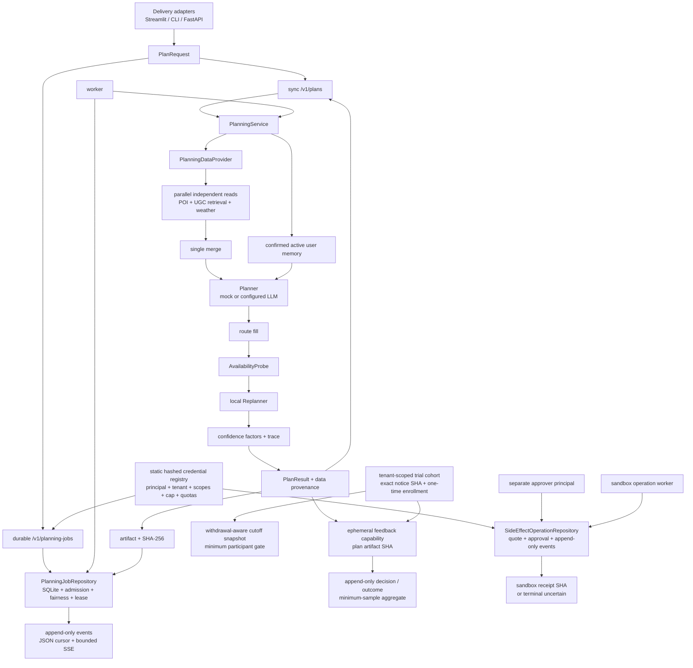
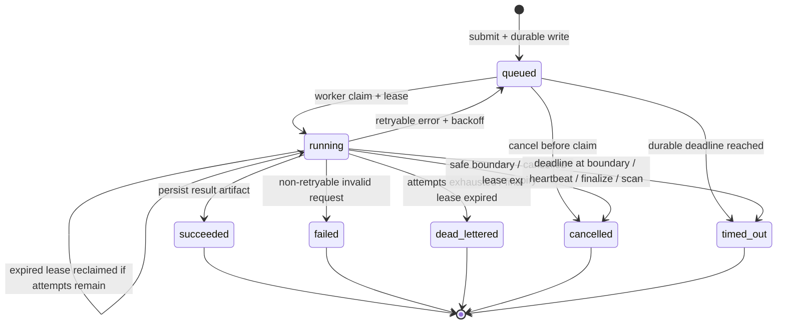
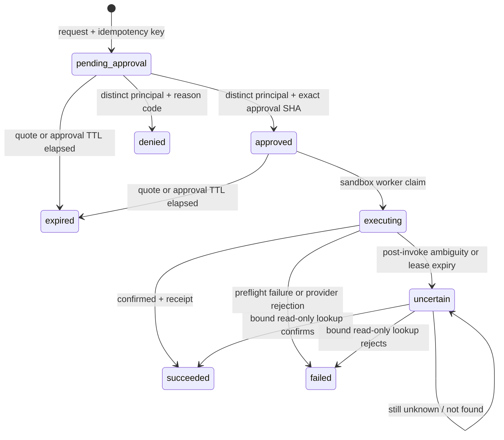

# BJ-Pal 系统设计

> 当前版本：v6.9。本文描述公开仓库当前实现，不用黑客松历史数字替代运行证据。

## 1. 目标与非目标

BJ-Pal 的目标是把自然语言的北京短时活动需求，转换为可执行、可解释、可恢复的结构化计划，并让公开仓库可以离线复现主控制流。

当前非目标：

- 不证明实时商家余位、实时拥挤度或真实下单成功；
- 不把 synthetic 数据上的回归通过率表述为用户成功率；
- 不为“多 Agent”标签拆分远程服务；
- 不把已经实现的沙箱审批、幂等和 side-effect receipt 冒充真实预订能力；
- 不把 synthetic contract、seed outcome 或少量自报反馈冒充用户成功率；
- 不用 SSE/WebSocket 连接承担 durable task 状态。

## 2. 总体架构



架构分成四层：

1. Delivery：收输入、做协议校验、展示结果，不拥有业务顺序。
2. Application：`PlanningService` 统一 generate → probe → reroute → record。
3. Data plane：provider 负责数据读取、并发、来源和部分失败；不让 LLM 直接访问 SQLite。
4. Decision plane：LLM 或离线 mock 负责从受控候选中选择、排序、生成理由；确定性规则负责硬约束和状态。

## 3. 同步规划链路

`POST /v1/plans` 适合本地演示和耗时可控的请求：

1. Pydantic 严格校验字段，拒绝未知字段、非法时间、人数和预算。
2. HTTP schema 映射为应用层 `PlanRequest`。
3. provider 通过进程级 8-worker 有界执行器并行读取 area summary、五类 POI 候选、query-specific UGC evidence 和天气快照；SQLite 分支使用独立连接，天气 adapter 使用共享 TTL cache。
4. 单一 merge 节点得到不可变 snapshot；检索命中携带算法、分数、扩展词和命中特征，部分失败写入 `ProviderIssue`。
5. Planner 只能从候选池选 POI，输出结构化 `Plan`。
6. 程序补路线，Probe 扫风险；Replanner 先按 reason/kind 执行硬过滤，再只替换失败步骤，并把 policy evidence 写入事件。
7. 最终方案以一个 `BEGIN IMMEDIATE` 事务原子替换整份 trace，避免逐步 DELETE/INSERT 时暴露半份状态，并减少 SQLite 写事务数量。
8. `PlanResult` 同时返回初版、终版、reroute events 和 DataProfile。

同步端点不提供断线恢复。需要恢复语义时应使用 durable job。

## 4. Durable planning job

### 4.1 状态机



### 4.2 身份分离

| ID | 作用 | 生命周期 |
|---|---|---|
| `request_id` | HTTP/日志关联 | 一次客户端请求 |
| `job_id` | durable execution ownership | 一次任务 |
| `plan_id` | 业务方案与步骤 trace | 一份方案 |
| `artifact_id` | 持久结果引用 | 一份完成产物 |
| `Idempotency-Key` | 防止重复提交 | 调用方定义的同一操作窗口 |

同一 tenant 内，同一个 `Idempotency-Key` 配相同规范化请求、deadline 秒数和 priority 返回原 job；任一策略变化都返回 409。不同 tenant 可以复用相同 key，避免调用方命名空间互相阻塞。worker 在 store transaction 中原子 claim，只有持有未过期 lease 的 owner 能 heartbeat、完成或安排重试。heartbeat 默认在 lease 的约三分之一处续租；过期 `running` job 只有在剩余 attempt 充足时才可被另一个 worker reclaim，旧 owner 被 fencing 条件拒绝。

v6.27 将 `PlanningJobService` 对持久层的依赖收敛为 `PlanningJobStore` Protocol。factory 默认选择 SQLite，只有显式设置 `BJ_PAL_JOB_STORE=postgres` 且提供 DSN 才构造 PostgreSQL adapter；backend/DSN 矛盾、未知 backend 或缺 DSN 都失败关闭，DSN 不进入 repository `repr`。PostgreSQL schema 保留 job、event、admission audit 和 tenant scheduler state；状态变更与对应事件仍在同一事务。为了复用已经验证的 transition policy，adapter 提供窄 DB-API compatibility layer，把参数占位符、event `RETURNING` 和 scheduler priority function 映射到 PostgreSQL。短 claim/admission/write transaction 使用 transaction-level advisory lock，实际 Planning 执行发生在锁外。这一取舍优先确定性准入和公平选择，代价是写/claim 吞吐受串行化；它不是 Redis/Kafka queue，也没有证明高可用或容量。

PostgreSQL 17 集成验收创建隔离 schema：4 个独立 OS worker 进程共享 store 并领取 12 个 job，最终每个 job 只出现一次 claim；8 个并发连接在 active limit=3 时得到 3 admitted / 5 rejected，audit 数量一致；另覆盖过期 lease reclaim、旧 owner fencing、idempotency、dead letter/replay、workload evidence 和 append-only trigger。该证据证明本机 cross-process 共享存储语义，不证明跨主机网络分区、exactly-once、故障转移或生产吞吐。当前也没有自动把 SQLite 历史 job 迁到 PostgreSQL，切换必须另做 migration/cutover/rollback。

v6.28 实现了这条 migration/cutover/rollback 路径，但明确采用停写窗口而非双写。dry-run 只读 source/target；apply 需要两次精确确认，拒绝 WAL、running lease 和非空 PostgreSQL target。迁移持有 SQLite `BEGIN IMMEDIATE`，同时让 PostgreSQL 使用与正常 job transition 相同的 transaction advisory lock；按稳定 sequence 复制 job、event、admission、scheduler state，显式保留 row/event ID 并重置 sequence。source/target 表级 count 与 logical digest 完全一致后，append-only receipt 才与数据同事务提交。故障注入证明复制中断不会留下部分 target row；相同 source 重试返回原 receipt。SQLite 保留为 rollback source，但只有两个 store 都未漂移时 `rollback_safe=true`；切换后 PostgreSQL 产生任何新状态都必须 forward reconcile，工具拒绝把旧 SQLite 写成安全回退点。[PR #21](https://github.com/estelledc/bj-pal/pull/21)、main Core/Pages 与 `v6.28.0` OCI workflow 已通过，公开镜像 digest 为 `sha256:5767a1e2cfe6b8ad0121ecb654720eefd02257added57d8e21d8b373d56550e9`。这证明的是本机与 CI PostgreSQL 17 下的可审计 offline cutover，不证明 operator 真已停完全部进程、托管备份、在线迁移、HA 或 RPO/RTO。

v6.29 将 PostgreSQL normal transition 从 per-operation connect 改为同步有界 `ConnectionPool`。pool 以 `open=False` 构造，再 `open(wait=True)` 验证最小连接；每次借出执行 `check_connection`，transaction context 负责 commit/rollback 和归还。默认 `min=1/max=4/timeout=1s/max_waiting=8`，环境值有明确上下界且 `min<=max`；等待队列满、获取超时、已关闭和连接失败均映射为不含 DSN 的稳定 `JobStoreUnavailable`。FastAPI lifespan 只关闭实际创建的 job service，worker 在 `finally` 关闭；SQLite port 的 `close()` 为无共享 handle 的 no-op。pool 关闭后禁止新工作，也不能 reopen。完整配置与运行边界见 [POSTGRES_POOL.md](POSTGRES_POOL.md)。

真实 PostgreSQL 17.10 acceptance 在 `max=2` 时持满两条连接，排队请求 0.105 秒后 timeout，额外等待者立即失败关闭，两类错误均未出现 DSN；释放后 probe 恢复。测试随后以 `pg_terminate_backend` 终止已归还连接，借出前检查丢弃它并观察到新 backend；64 次、并发 2 的 `SELECT 1` probe 64/64 成功，p95 2.593 ms，关闭后 application session 回到启动前 0。artifact 不保存 DSN、host、port、用户、schema 或 PID，独立 verifier 从 raw latency、配置、恢复与 SHA 复算 gate。这证明单机连接容量与局部坏连接恢复，不证明 PostgreSQL server failover、跨主机网络分区、生产吞吐、HA、RPO/RTO 或 SLA。

retryable 异常按 `base × 2^(attempt-1)` 计算有上限的退避，并写回 `queued + available_at`；到达 `max_attempts` 后进入显式 `dead_lettered`。持久请求反序列化失败属于 non-retryable，直接进入 `failed`。状态与事件在同一事务变更；若事件 INSERT 失败，状态更新回滚。

claim 使用 `tenant_fair_priority_aging_v2`：先由 `priority_aging_v1` 对 0-9 基础优先级从 `available_at`（lease reclaim 时为原 `lease_expires_at`）起每等待 60 秒提升一级、最高 9；再在同一有效优先级内选择 `planning_tenant_scheduler_state.last_claimed_event_id` 最小的 tenant；最后按 `eligible_at`、`created_at`、`job_id` 升序选择。retry backoff 到期前不进入候选集，因此不会把冷却时间算成排队等待。claim 与 tenant scheduler state 在同一 store write transaction 更新；claimed/lease_reclaimed event 保存组合 policy、priority policy、fairness policy、tenant、选择前 cursor、base/effective priority、eligible time 与 `queue_wait_ms`，可独立复算。这保留了高优先级优先语义，只在同优先级内轮转 tenant；新 tenant 的 cursor 为 0，会先获得一次机会。它不保证严格全局公平或启动时间。

取消是协作式状态转移，不是杀线程：queued job 直接 `cancelled`；running job 先写 `cancel_requested_at`，Application Service 在 Planner 前后和 Probe 后检查，worker 返回时也会在完成事务内让取消优先于 success/retry。若 worker 已失联，lease 过期扫描把请求收敛到 `cancelled`，不会再 reclaim。单次正在进行的模型/provider 调用如果不支持 cancellation token，只能等它返回。

deadline 与 lease 是两套语义：lease 证明某个 worker 的临时 ownership；`deadline_at` 是 job 的绝对生命周期上限。新提交默认 900 秒，可在 1-86400 秒内指定。queued 到期不会被 claim；running 到期会在 heartbeat、success/fail、retry、扫描或 Application Service 安全边界结算为 `timed_out`。取消与 deadline 竞争时比较 `cancel_requested_at` 和 `deadline_at`，较早的持久信号获胜。deadline 不会强杀已进入的单次模型/provider 调用，后者仍需 adapter cancellation token。

人工重放只允许 `failed` / `dead_lettered` / `timed_out`：原 job 保持终态并追加 `replay_requested`，新 job 以 attempt 0、继承的 max attempts、priority、deadline 秒数策略、新的绝对 deadline 和 `replayed_from_job_id` 入队。重放必须提供独立 `Idempotency-Key`；同 key 重试返回同一 replay job，不能被普通 submit 复用。原事件和新 job 在一个事务内写入。

`GET /v1/planning-jobs` 提供 status 过滤和 `after_job_id` 游标。游标在当前 tenant 内解析为 store insertion sequence（SQLite `rowid` / PostgreSQL `BIGSERIAL rowid`），外租户游标按不存在处理，避免借游标探测资源；返回轻量摘要，不读取或内联 request/result JSON blob。完整 artifact 仍通过同 tenant 的单 job GET 获取。

所有 job 控制面 route 共用 `identity_scope_v1` gate。推荐配置 `BJ_PAL_CONTROL_PRINCIPALS_JSON`：每个注册项只保存 32+ 字符原 token 的 SHA-256，并映射到服务端定义的 `principal_id`、`tenant_id`、scope 集、`max_priority`、`tenant_active_job_limit` 和 `tenant_submission_limit_per_minute`。后两个字段默认 100/60；同一 tenant 的多个 principal 必须拥有完全一致的 admission policy，避免换凭证绕过 tenant 规则。Bearer candidate 同样先哈希，再与全部注册 hash 做 constant-time 比较；原 token 不进入 registry、job/event payload 或响应。registry 缺失/非法返回 503，凭证缺失/错误返回 401，scope 或 priority cap 越权返回 403。旧 `BJ_PAL_CONTROL_TOKEN` 保留为单管理员兼容模式，映射到 `default/legacy-control`、全部 scope、priority 9 和默认 admission policy。

route scope 固定为 `jobs:submit/read/control/replay` 与 `operations:request/read/approve/reconcile`；job continuation 需要 submit scope。tenant/principal 从注册凭证派生，不接受客户端自报 header。submit/list/get/event/SSE/cancel/replay/continuation、admission audit、operation request/read/decision/reconciliation 与幂等键都带 tenant 条件；跨租户资源统一返回 404，避免泄露是否存在。`submitted_by` 和 `tenant_id` 落入 job/summary/submitted event；continuation 在授权、cap 和 admission 校验成功前不消费 resolution。repository 的无 tenant 参数仅供内部 worker 路径使用，HTTP 路径必须显式传 tenant。

`tenant_admission_v1` 覆盖所有创建新 job 的入口：普通 submit、manual replay 与 job clarification continuation。在与 INSERT 相同的 store write transaction 内，repository 先结算到期 deadline，再统计当前 tenant 的 queued/running active job 和 `(now-60s, now]` 已接受新 job；active cap 优先，其次检查 accepted-submission cap。拒绝返回结构化 429；滑动窗口拒绝按最早 accepted job 离开窗口的时间计算 `Retry-After`。完全匹配的幂等重试直接复用原 job，不消耗新 quota，但仍记录 `idempotent_reuse`。这不是原始 HTTP attempt 限流器：401/403、幂等复用和被拒绝请求都不计入 accepted-submission 窗口。

每次 admitted/rejected/idempotent-reuse decision 都写入 `planning_job_admission_events`，包含 policy、tenant/principal、operation、计数快照、限制、原因、可选 job ID 与 retry-after。SQLite/PostgreSQL trigger 都禁止 UPDATE/DELETE；`GET /v1/planning-admission-events` 需要 `jobs:read` 并按当前 tenant 的全局 event cursor 读取。拒绝事件必须先 commit 才向 HTTP 抛出 429，避免错误路径丢审计。该表当前没有 retention/compaction，若面对恶意拒绝流量会产生存储放大；公网部署前还需要入口层 raw-attempt limiter 和审计保留策略。

当前限制：这仍是应用层隔离，不是 OAuth/OIDC、动态 RBAC、PostgreSQL RLS 或企业 IAM；没有 credential 过期、动态轮换/撤销、secret manager、在线 reprioritize、请求加密或网关 raw-attempt quota。v6.2 receipt 与 status lookup 只来自确定性沙箱，不是外部供应商签名订单证据。PostgreSQL 让多个进程共享准入/调度/fencing 状态，但 lease 仍是 owner+expiry 条件而非外部副作用 exactly-once 证明；tenant 注册由静态 registry 控制，否则不断创建新 tenant 可博取首次轮转机会。默认 300 秒 lease、900 秒 deadline、100 active 和 60 accepted submissions/minute 只适合当前作品集任务，不是生产容量结论。

### 4.3 Append-only 事件

`planning_job_events` 只允许追加，SQLite/PostgreSQL trigger 拒绝 UPDATE/DELETE。submitted、claimed、heartbeat、retry_scheduled、lease_reclaimed、cancel_requested、cancelled、timed_out、replay_requested、succeeded、failed 和 dead_lettered 与对应 job 状态在同一事务写入，因此不会出现“状态已变但事件丢失”的双写窗口。v4.3-v4.8 SQLite 表通过保留式重建补齐后来状态；v4.9-v5.7 先补 `priority=0`，v5.9 再以保留式重建补 `tenant_id=default`、`submitted_by=legacy-migration`，并把全局 idempotency unique 改成 `(tenant_id, idempotency_key)` partial unique；v6.0 以 additive migration 新增 admission event 和 tenant scheduler state 表。迁移保持 row、event ID/history 和 foreign-key check。旧 SQLite 任务的 `deadline_at=NULL` 仍 grandfather 为无新增 deadline，避免迁移时凭空让历史任务过期；这不是 SQLite→PostgreSQL 数据搬运。

`GET /v1/planning-jobs/{job_id}/events` 以 `after_event_id` 做 JSON 游标重放；`GET .../events/stream` 从同一表编码 SSE，SQLite `event_id` 同时作为 SSE `id`。重连时 `Last-Event-ID` 转为查询游标，显式 `after_event_id` 优先。stream 最长 30 秒，终态事件发出后立即结束；超时只发送 SSE comment，不伪造领域事件。事件 payload 保存 request/artifact hash、lease、backoff 和稳定错误码，不保存原始 exception 或凭证。

### 4.4 Approval-gated sandbox operation

副作用不复用纯计算 job 的 retry/reclaim 状态机。`SideEffectOperationRepository` 使用独立 SQLite 数据库和 `approval_gated_operation_v1`，当前只接受 `restaurant_booking`，且报价必须显式为 `provider=bj-pal-sandbox`、`sandbox=true`。action 与 quote 的 reference、有效期、币种、金额和 `terms_sha256` 先形成规范化 request SHA；approval SHA 再绑定 operation ID、tenant、request SHA、policy 和审批到期时间。修改报价、动作或审批 fingerprint 都不能沿用原批准。



请求者不能审批或拒绝自己创建的 operation；审批 principal 必须来自相同 tenant。`Idempotency-Key` 只在 tenant 内、完整 request fingerprint 相同才复用；不同动作或报价返回 409。批准/拒绝也幂等，但已持久的 actor、decision 或 reason 不允许被另一决策覆盖。所有 operation/event 查询带 tenant 条件，跨 tenant 统一 404。

独立 worker 只 claim 未过期的 `approved` operation，且 `attempt` 固定为一次。调用前失败进入 `failed` 且无 receipt；供应商明确拒绝进入 `failed` 并保存 rejection receipt；确认成功进入 `succeeded` 并保存 receipt；调用后响应不明确，或 executing lease 到期，则进入 `uncertain` 且不自动重试。只有已经持久化 provider operation ID 的不确定操作才能调用 `operations:reconcile`：adapter 做一次只读 lookup，repository 严格核对 operation ID、request SHA、provider、provider operation ID、sandbox flag 与 raw provider payload SHA，随后追加 `side_effect_status_lookup_v1` 证据。`confirmed/rejected` 生成与查询响应绑定的 receipt 并收敛状态；`still_unknown/not_found` 保持 uncertain，继续禁止自动写重试。lease 到期但尚无 provider reference 的操作只能进入人工处置。

`side_effect_receipt_v1` 绑定 operation ID、request SHA、provider、sandbox flag、provider operation ID、outcome、执行时间和 provider response SHA，并对 canonical receipt envelope 计算 SHA。`side_effect_operation_events` 与 `side_effect_operation_reconciliations` 的 trigger 都禁止 UPDATE/DELETE；后者保存 raw status-lookup evidence、canonical evidence SHA 和可选 receipt SHA。普通执行当前仍不保存 raw provider response，sandbox verifier 能复核 envelope、查询 raw payload 和绑定关系，但不能证明第三方签名或真实订单存在。

补偿不属于 reconciliation，也不能藏进失败重试。未来若 provider 支持取消，必须新增独立 `restaurant_cancellation` operation：显式保存 `compensates_operation_id`，重新获取取消条款/费用 quote，生成新的 request/approval SHA、幂等键和 receipt，并要求非 requester 的独立审批；只有原 operation 已由可信状态证据确认成功时才允许申请。当前版本没有实现该写操作，UI/CLI 也不会把“撤销”伪装成自动回滚。

## 5. 数据面与 provenance

`PlanningDataProvider.collect()` 返回 `PlanningDataSnapshot`：

- `area_summary`：UGC 聚合上下文；
- `candidates`：每类独立的 `tuple[POI, ...]`；
- `evidence`：来源、classification、freshness、provider reference、bookable 和 warnings；
- `retrieved_evidence`：与用户 query 对齐的 UGC evidence、算法、分数、扩展词和命中特征；
- `issues`：结构化部分失败，区分 required/retryable。
- `weather`：按公开片区中心查询的小时快照；Planner 排序和后续 Probe 使用同一份 decision context。

本地 `SQLitePlanningDataProvider` 使用独立连接并行读取各分支，完成后按请求的 category 顺序单点合并。v4.6 将历史上的 per-request thread pool 改为进程级固定 8-worker executor，防止 HTTP 并发把线程数按请求倍增。任一可选类别失败不会被计成“0 元成功结果”；所有候选都为空时，Planner fail closed。

公开 profile：

| profile | classification | freshness | bookable |
|---|---|---|---|
| `demo` | synthetic | not applicable | false |
| `real-cache` | mixed | cache timestamp currently missing | false |

真实 provider 的最低新增字段应包括 `retrieved_at`、`valid_until`、provider/model reference、cache scope、stale 标记和 warnings；报价/库存类还必须有 currency 与 bookable 语义。仅仅调用了真实 API 仍不能证明可购买或可预订。

### 5.1 Open-Meteo 天气边界

`src/providers/weather.py` 将天气保持在普通数据服务层，而不是新增一个 Weather Agent：

- 默认 `RecordedWeatherProvider` 读取 authored synthetic fixture，公开 clone 和 `make check` 不触网；
- live adapter 只接受 `noncommercial + explicit ack`、`commercial + customer key` 或显式 `self_hosted` 三种配置，错误配置在构造阶段 fail closed；
- 请求固定 WGS84 片区中心、IANA timezone 和六个小时字段；默认 3 秒 bounded timeout，不在 adapter 内盲目重试；
- 只有“今天/明天/后天/周几/周末/ISO 日期”等可确定表达会解析成 `target_date`；live 请求用精确 `start_date/end_date`，含糊日期或超过 16 天窗口时以 typed issue 降级，不默认查今天；
- 429/5xx/transport 属于 retryable，4xx/schema/unit drift 属于 non-retryable；
- 进程级 provider 缓存默认保存 15 分钟，刷新失败只能在限定窗口返回显式 `stale_if_error`，不会把过期值标 fresh；
- Open-Meteo 返回的是模型预报，不是站点观测；`best_match` 也不是固定模型版本，provenance 不虚构 model run；
- Planner 先按同一快照调整 shelter 排序并把小时点写进 `Plan.weather_context`，Probe 根据每步 `weather_shelter` 复用该快照，LLM 不直接访问外部 API。

免费端点只限非商业用途。由于作品集属于宣传性场景，默认仓库不执行 live smoke；商业部署必须使用付费 customer endpoint 或自托管，并保留邻近 attribution。`evals/weather` 的 artifact 明确是 `offline_contract_only`，不能当作 live availability、预报准确率或商业授权证据。

### 5.2 UGC 检索与评测

legacy BM25 保留为冻结基线。v4.4 查询层增加确定性领域词扩展、aspect 加分、confidence tie-break 和 POI-level 去重，并把这些特征随命中返回，避免把检索逻辑藏进 LLM。

`ugc-retrieval-core-v1` 有 19 条人工标注的 synthetic case。当前本机 artifact 显示 HitRate@5 与 MRR@5 未变化，Macro Recall@5 从 0.974 到 1.000，top-5 unique subject ratio 从 0.705 到 1.000。它只证明小型合成集合上的多意图覆盖与多样性，不证明线上 RAG 准确率。

## 6. LLM 与确定性程序的边界

| 交给 LLM | 留给程序 |
|---|---|
| 理解用户原话 | Schema 校验和字段范围 |
| 生成自然语言解释 | 执行关键缺口、默认假设与澄清状态 |
| 从候选池选择 | 数据查询、缓存与来源 |
| 安排行程顺序 | POI grounding 与去重 |
| 生成 rationale | 预算、时间、地理和饮食硬约束 |
| 解释 reroute | 状态机、lease、幂等和 artifact hash |

当前默认 mock client 让公开 CI 离线可运行。配置真实 LLM 只改变决策节点，不会把 synthetic provider 自动升级为真实数据面。

### 6.1 约束保持型局部重规划

v5.1 把“找到一个不同 POI”与“找到语义合法的替补”分开。`ReplacementPolicy` 在 ranking 前执行硬过滤：

- `meal` 只接受能识别为正餐的候选，不能因评分高把中餐替换成咖啡馆；
- `snack/rest` 排除正餐，避免休息站变成一顿大餐；
- `weather` 不再坚持同类替换，而是从 museum/shopping 跨类召回，并拒绝 `open` shelter；
- failed/trap、方案已用地点和 session exclusions 在语义过滤前排除；相同 POI ID 去重后才计数；
- 排序只在 hard-eligible 候选上运行，找不到合法候选就 `warn_only`，不拿违规替补制造成功。

每个 `RerouteEvent.replacement_policy` 保存策略版本、原 step kind、reason、来源类目、shelter/meal 约束，以及 raw/unique/identity-eligible/semantic-eligible 四段计数。它能回答“为什么选/为什么没选”，但仍是小型规则集；只有真实用户 reroute 接受/撤销 outcome 到位后才能评价业务效果。

### 6.2 Replan 路线快照一致性

换掉第 `i` 站会同时使“`i-1 → i`”和“`i → i+1`”失效。历史实现只替换 `Step`：新站的路线字段为空，而下一站继续携带由旧 POI 计算的入站 leg，接口仍能成功返回，因此属于静默一致性错误。

v5.2 新增 `refresh_plan_routes`，约束如下：

- Planner 初次生成和 Replanner 成功替换都走同一入口；路线 lookup 和坐标 resolver 可注入测试替身；
- 每次刷新先清空所有 `travel_time_min/travel_distance_m/travel_options`，再重算完整短路线，任何失败都不能恢复旧字段；
- 只连接 list 中真正相邻且都有坐标的 POI，不跨过 `depart`、缺 POI 或缺坐标 step；
- 每条成功 leg 保存选中 mode、选择理由、距离、耗时及各 mode 的 `cached/estimated` 来源；
- `Plan.route_context` 与 `RerouteEvent.route_refresh` 共用 `route_refresh_v1` 证据，记录受影响站位、刷新数量、缺坐标和 warning；
- 当前 lookup 仍是本地缓存优先、确定性估算兜底，不是实时路况或在线导航。

这是“先清陈旧数据，再显式降级”的 fail-closed 语义。当前方案通常只有 3-6 个 leg，全量重算比维护易错的局部 patch 更值得。

### 6.3 路线感知的时间轴

`Step.start_time` 的业务语义是“到达该站的时间”。历史 Planner 只校验 `previous.start + previous.duration <= current.start`，却在之后才填 `current.travel_time_min`，因此 14:00 停留 60 分钟、15:00 到下一站、路程 5 分钟仍会通过，时间轴在数学上重叠。

v5.3 的 `reconcile_plan_schedule` 在每次 route snapshot 后运行：

1. 只把真正相邻 POI 的 destination incoming travel 计入总时长；未验证路线不按“0 成本成功”处理，而是让 schedule 进入 `partial`；
2. 从 `prefs.target_start` 起按 `上一站到达 + 停留 + 入站路程` 级联重排；depart 表示开始返程，不虚构回家路线；
3. 若 dwell + travel 超过 `duration_hours`，按 `minimum_dwell_v1` 依次压缩 rest、snack、shopping、culture、citywalk、meal，但不低于显式下限；
4. 若安全压缩后仍超时，保留计划并返回 `status=overrun` 与分钟数，不自动删站，也不声称符合窗口；
5. `Plan.schedule_context` 和 `RerouteEvent.schedule_refresh` 保存调整前后 dwell、travel、预计结束、time/duration adjustments 与 warning；HTTP/durable 输出共用该证据。

默认 4 小时 demo 的原始 270 分钟停留加 10 分钟路程，会先把 rest 45→20、culture 90→75，再重排为 14:00→15:05→16:23→17:40→18:00。这里的 `complete` 只表示当前缓存/估算路线下内部约束闭合，不代表实时路况准确。

### 6.4 执行前 Requirement Gate

历史实现会把“还是上次那个地方，下午安排一下”直接套入默认五道营片区并生成 5 步方案。问题不是 Planner 文案质量，而是缺少历史地点时仍启动了检索、模型和工具链。

v5.4 在唯一 Application Service 入口增加纯确定性的 `RequirementNormalizer`：

1. `proceed`：结构化 `area_anchor` 明确，或文本可规范到受支持片区；例如“三里屯”先解析为 `三里屯片区` 再交给 Planner；
2. `proceed_with_assumptions`：缺少的是可逆低风险信息，例如普通请求未给片区时显式记录公开 demo 默认值，不额外打断用户；
3. `clarification_required`：历史/序号指代无上下文、家/公司附近却无位置，或文本片区与结构化字段冲突；返回一个问题和 2-3 个选项，并在任何 Planner/tool fan-out 前停止；
4. HTTP 同步和 durable submit 都返回 `409 clarification_required` 及同一结构化 decision；异常持久请求在 worker 端 non-retryable failed，不进入重试风暴；
5. `PlanRequest.provided_fields` 随 durable payload 保存，区分调用者显式片区与 schema 默认值；成功结果把 decision 写入 canonical `PlanResult` 和 artifact。

20 条 hand-authored synthetic golden case 固定了触发/不触发和补充后状态：当前 clarification trigger rate 0.350、false clarification rate 0、required clarification recall 1.000、post-clarification gate executability 1.000。这里的 executability 只表示补充后通过门控，不代表完整计划、真实预订或用户满意。

### 6.5 Constraint Ledger：自然语言硬约束不漂移

v5.4 解决了“能不能开始执行”，但没有解决“执行时是否真的用了用户说的参数”。真实 FastAPI 坏例 `周六下午三点，两个人在三里屯玩三小时，人均预算100元，不吃辣` 曾返回 200，却仍用 schema 默认的 3 人、14:00、4.5 小时、空忌口和空预算生成计划。

v5.5 在 Requirement Gate 之后、Planner/provider fan-out 之前增加 `PlanningPreflight → ConstraintNormalizer`：

1. 只抽取当前 `UserPreferences` 能执行的字段：persona、人数、儿童/年龄、忌口、步行半径、人均预算、开始时间和时长；片区仍由 Requirement Gate 独立负责；
2. `ConstraintEntry` 同时保存最终值、文本值、来源、原文 evidence、hardness 和 merge outcome；`rewritten_query` 当前只作为可审计的规范化摘要返回，不替换 Planner 原输入，原始 `user_input` 也不被覆盖；
3. 调用方 `provided_fields` 与文本一致时标记 `matched`；忌口采用安全并集并标记 `merged`；人数、预算、时间、时长、persona 等显式值冲突时生成 `ConstraintConflict`，同步 API 和 durable submit 在 Planner 前返回结构化 409；
4. 文本派生值写入规范化 `PlanRequest`，但不加入 `provided_fields`，因此不会伪装成调用方显式输入；提交到 durable store 后再次预检保持请求、字段来源和 ledger 幂等；
5. UI/CLI/HTTP/worker 共用同一 preflight，成功 `PlanResult` 与 durable artifact 都携带 `constraint_ledger_v1`；UI 后续 addon、timeline 和诊断也读取规范化后的 preferences，而不是旧控件快照。

30 条 hand-authored synthetic case 覆盖正例、否定短语、显式冲突、安全合并和序列化重放；当前 field extraction precision/recall/F1、hard-constraint preservation、conflict recall、rewrite coverage 与 round-trip idempotency 均为 1.000，false extraction/conflict rate 为 0。该结果只对固定规则和已声明字段成立，不代表开放域中文理解或真实用户成功率。

### 6.6 澄清 continuation 状态机

v5.6 把 `clarification_required` 从一次性 409 升级为短期、可审计的 continuation：

```text
pending --same typed answer--> resolved --lease claim--> executing
   |                               |                       |
   | TTL                           | different answer      +--plan/job success--> completed
   v                               v                       +--next ambiguity--> completed(next continuation)
expired                   resolution_conflict              +--failure--> resolved
```

每个 `clarification_sessions` 行保存原始 `PlanRequest`、request SHA-256、Requirement/Constraint decision、typed options、delivery、job deadline/priority policy、resolution、执行 lease 和结果引用。`decision_sha256` 绑定 request hash、delivery、requirements、constraints、policy 与 options，防止答案被套到另一份问题上；resolution、resolved request 和 result 也分别有 SHA-256，早期本地 v5.6 表通过 additive migration 回填。`ClarificationResolution` 携带 decision 指纹进入请求，Requirement Gate 或 Constraint Ledger 只消费 code/field 匹配且类型合法的 resolution。

同步和 job 各自暴露 continuation endpoint。相同答案重复提交返回缓存计划或同一 job，不同答案返回 `clarification_resolution_conflict`；执行 claim 用 owner + lease fencing。若解决第一项后仍有下一项冲突，父 session 以 completed result 固定指向同一个 child continuation，重试不会不断创建新问题。job continuation 复用原 deadline/priority policy，并以 `clarification:{continuation_id}` 作为内部幂等键。这里不声称跨进程 exactly-once：同步 planning 没有真实副作用，崩溃若发生在计算后、结果落库前仍可能重算；真实预订仍必须另加 operation id 和 receipt。

默认 TTL 为 900 秒，completed 也在 TTL 后逻辑过期；过期 session 不能再解析或执行。`purge_expired` 的默认诊断保留阈值为 24 小时，并在新 session issue 时触发；休眠实例若要求严格墙钟删除，仍需外部定时调用。SQLite 当前明文保存原始请求，没有用户身份、加密、租户隔离或备份删除证明，因此 continuation ID 按短期 capability 处理，不能进入公开 URL、普通日志或长期分析。

16 条 hand-authored synthetic case 覆盖人数、预算、时间、时长、persona、儿童、步行半径、片区冲突、相对位置和历史/序号指代；独立 verifier 从 raw case 复算一步续跑、最终生效值、同冲突复发、request/decision 指纹、durable restore、option contract、round-trip 与不同答案 fencing。所有成功率指标为 1.000，同冲突复发率为 0；这些仍不是开放域多轮理解或真实用户满意度。

### 6.7 用户记忆状态机

正常规划只读 Memory，不会根据每次 query 自动写入。当前唯一写入口是 UI 的显式“记住偏好”，LLM 只负责从这段明确输入中抽取结构化候选。

每条状态包含 `source`、`confirmed_at`、`expires_at`、`revision`、`mention_count` 和 soft-forget 标志：

```text
不存在 --write--> created
同值 active --write--> reinforced (mention_count +1)
异值 active --confirmed write--> replaced (revision +1, mention_count =1)
异值 active --unconfirmed write--> conflict_rejected
unconfirmed --user confirm--> confirmed
active --forget--> soft forgotten
expired / forgotten --write--> replaced
任意状态 --hard delete--> state + audit hashes purged
```

Planner 只读取已确认、未过期、未 forgotten 且高于置信阈值的条目。事件表只保存 value SHA-256、来源、revision 和原因，不复制偏好原文；事件禁止 UPDATE，但用户 hard delete 时会一并删除审计 hash。这里明确选择“用户删除权高于不可删除审计”。写事务使用 `BEGIN IMMEDIATE`，同值并发写不会丢 mention reinforcement。

### 6.8 Plan-level Human Outcome Evidence

规划链与反馈链刻意解耦。canonical `PlanResult` 不保存反馈 capability；HTTP/Streamlit delivery 在拿到最终方案后，对 canonical plan JSON 计算 SHA，再发放 14 天限时 capability。数据库只保存 capability SHA，提交时同时核对 plan ID 与 artifact SHA。

反馈分成 decision 与 outcome 两个 phase，各自只允许三种枚举 value；负向值必须给受控 reason code，正向值不能夹带原因，接口没有自由文本字段。report 以 `(plan_id, plan_artifact_sha256, phase)` 唯一，idempotent retry 可安全返回同一 report，其他覆盖被拒绝；invitation/report trigger 禁止 UPDATE/DELETE。

公开汇总只称 `self_reported_unverified`。每个 phase 至少 5 份才显示对应比例，门槛前返回 `null`。这只是防误导底线，不是统计显著性。plan-level `accepted/completed` 也不能复制给每个 step 计算 ECE；旧 `plan_outcome` 因此新增 evidence classification，真人逐步校准只读取 `human_verified_step`。

### 6.9 Consent-bound Trial Cohort

v6.4 在普通 feedback 之外增加独立试用协议。tenant operator 创建有截止时间的 cohort，并为每位候选参与者发放一次性 enrollment code；参与者只有对服务端返回的精确 consent notice SHA 明示同意后，才得到 session-only participant capability。数据库始终只保存 enrollment/participant/feedback capability 的 SHA。

notice 明确试用用途、收集与不收集字段、自愿参与、退出方式、窗口和 retention deadline。participant、trial-bound feedback invitation 与 report 都绑定同一 notice SHA；同一 participant capability 每个 phase 最多一条。它能证明不同匿名能力凭证，不能证明不同真人身份。

退出事件只追加：开放批次内，退出后不再授权规划或反馈，并从后续聚合排除。关闭批次会冻结精确 cutoff 的 evidence root 与 snapshot，之后不再改变历史汇总。trial-bound report 不进入旧公开 feedback summary；每 phase 少于 5 个有效 participant 时不返回 rate、value 或 reason distribution。retention 到期把状态标为 `raw_purge_due`；v6.6 可由本地受信 operator 显式清除该 cohort，但仍没有托管调度、生产加密或外部备份删除证明。

### 6.10 Local Trial Operator Workflow

v6.5 给受信本地 operator 一个窄 CLI，而不是要求手写 SQL 或复制多段 curl。create 固化 cohort/notice；issue 在一个 SQLite 写事务内批量签发 1-100 个 enrollment capability，数据库仍只存 SHA。原始码只能写入显式确认的新建 secret bundle：`O_EXCL` 防覆盖、mode 0600、文件名模式由 `.gitignore` 排除，stdout 只返回 bundle SHA 和数量。

status 只投影当前门控 aggregate。close 是不可逆动作，必须精确复述 trial ID；任一 phase 低于 cohort 门槛时默认拒绝，只有显式 `--allow-insufficient-evidence` 才允许提前冻结。已经冻结的相同 close 重试返回原 snapshot，避免 operator 因网络或终端重试制造第二份证据。

本地 CLI 的信任边界是文件系统权限：它不经过远程 principal/scope 校验，因此不是生产 admin API。secret bundle 也不属于证据 artifact，组织者必须逐人分发并按试用策略删除；工具不能证明实际收件人身份或替代招募。

### 6.11 Retention-due Atomic Purge

v6.6 为 `manage_trial.py` 增加显式 purge，但只接受已冻结且超过 retention deadline 的精确 trial/tenant。operator 必须复述 trial ID、确认 secret bundle 已处置，并声明当前库没有受管备份或已由 operator 处置备份。重复请求返回同一收据，不会生成第二次清除事件。

repository 使用 `BEGIN EXCLUSIVE` 锁定单库，先重算 cohort/snapshot/evidence root 完整性，再要求 journal mode 为 `DELETE` 或 `TRUNCATE` 并开启 `secure_delete=ON`。事务内暂时移除相关 DELETE trigger，按 foreign-key 顺序只删除目标 trial 的 report、plan invitation、participant event、participant、enrollment、snapshot 和 cohort；随后核对 row count、恢复 trigger、执行 `foreign_key_check`，最后写入 append-only `trial_retention_purge_receipt_v1`。任一步失败时，DDL、删除和收据一起 rollback。

收据只保留随机 trial/receipt ID、tenant/operator SHA、cohort/snapshot/evidence-root hash、时间、删除行数与 disposition，不保留 tenant/operator 原文、capability 或反馈值。低熵 identifier 的无盐 SHA 只是 pseudonymization，仍可能被枚举猜测。`secure_delete` 提高本地 SQLite 页内容覆盖语义，但收据仍只证明 live-table 删除事务：它不是取证级擦除证明，也不能独立证明 secret 文件、文件系统快照、备份或复制库已删除。WAL 模式会 fail closed，避免把未清理 WAL 误写成已清除。

### 6.12 请求级执行预算与终止证据

`execution_budget_v1` 包在 canonical `PlanningService.execute` 外围，并通过 ContextVar 绑定当前请求。policy 由服务端构造或从 `BJ_PAL_MAX_*` 环境变量读取，HTTP payload、job payload 和 Planner prompt 都不能修改它。默认上限是 2 个逻辑 LLM call、1 个 data-provider batch、8 个 `tool.*` call、每个逻辑 LLM call 4 次 transport attempt、32768 个 provider-reported token 和 120000ms 安全检查点 wall-clock。

`trace_span` 在进入 `llm.*.complete`、`planner.collect_data` 或 `tool.*` body 前先计数并检查，因此 N+1 操作不会启动。LongCat/DPSK 关闭 Anthropic SDK 内建 retry，由应用层 `retry_with_backoff` 单独持有 transport attempt 上限，避免 SDK retry 与外层 retry 相乘。provider usage 只能在 LLM call 返回后取得；此时系统累计实际 input/output token，若超限则阻止后续阶段，但不声称能追回已消耗 token。provider 没有 usage 时保持 `unavailable`，不使用字符数或价格估算填空。

成功时 tracker 生成 `status=succeeded / termination_reason=completed` 的 hash snapshot，并与 trace 操作计数和 token 汇总对账后嵌入 `execution_observation_v2`。预算终止则抛出只包含 policy、计数、elapsed、reason 和 SHA 的 `ExecutionBudgetExceeded`：同步 HTTP 映射为 429，durable job 映射为 terminal `failed` 且不套用普通 execution retry。该快照不含 prompt、用户输入、user ID、token 原文或 provider response。

wall-clock gate 是协作式安全检查点，不是线程/进程强杀。若调用已经阻塞在网络或 SDK 内部，仍依赖 provider timeout 返回后才能观察超时。因此它不同于 durable job 的绝对 deadline，也不同于 HTTP/SSE connection timeout。当前 policy 还是单进程 request-local，不是 tenant 金额账户、跨实例全局 quota 或 billing reconciliation。

### 6.13 单分支与实验多分支的架构决策

历史 `planner_tot.py` 实际是同一个 Planner 的 3 个提示词分支，并由确定性规则选优；它没有远程 Agent、独立状态、协议互操作或 LLM judge，因此不能称为“多 Agent 协作”。该入口仍只用于离线实验，没有接入 `PlanningService`、HTTP 或 durable job。

旧实现在线程池中直接调用分支，Python `ContextVar` 不会自动跨新线程传播，导致 request-local budget、trace parent 和 execution capture 可被旁路。v6.8 对每个分支使用独立 `copy_context()`，共享的 tracker/capture 自身带锁；`ExecutionBudgetExceeded` 单独向上抛出，不能再被“失败一个分支继续选优”的普通降级语义吞掉。branch/worker 上限均为 3，重复标签和非法 temperature fail closed。

`orchestration-comparison` 在同一 deterministic mock 与 demo SQLite 上比较单分支和 3 分支：保存脱敏 plan projection、规则质量分解、branch accounting、完整 budget snapshot、故障注入和默认预算拒绝，再由独立 verifier 重算调用/数据倍率、质量 delta、输出指纹、SHA 与最终 decision。当前 3 个 synthetic case 中，多分支质量提升率和语义输出变化率均为 0，LLM call 与 data batch 均为 3 倍，所以 canonical 主链继续选择 `single_branch_default`。一个 post-generation 分支故障可以被其余 2 个分支容纳，但这只证明显式的局部故障语义；默认服务端 data-batch budget 会在第二个分支 body 前终止整次执行。

这是一项本项目的有界选择，不是“多分支永远无效”的普遍结论。mock 明确忽略 branch hint，quality score 也只是规则代理；本机 elapsed 只作诊断、不设性能门槛。只有获得真实 badcase/outcome，并在同口径下证明增益稳定超过调用、延迟和故障面后，才应重新考虑将多分支接入主链。

### 6.14 不可信模型输出与一次有界修复

Planner 的 JSON schema prompt 只是生成提示，不是运行时安全边界。旧链路会把解析结果直接交给宽松的 `Plan.from_dict`：未知字段可能被丢弃，类型可能被转换，截断 JSON 还可能被本地 `repair_json` 补成带 `_repaired` 标记的部分对象；POI ID/名称也没有和本次候选映射精确绑定。这意味着“代码里传了 schema”不能证明候选幻觉或结构漂移会被拒绝。

v6.9 在 `Plan` 构造、路线查询、schedule reconcile 与 trace 持久化之前增加 `model_output_contract_v1`。它使用 strict Pydantic model 拒绝 extra/missing/coercion/literal drift，并继续检查：persona/area 与请求一致、step index 连续、恰好一个无 POI 且零时长的末尾 depart、时间不重叠、非 depart POI ID 必须在当前候选池、名称精确匹配且不重复。本地补残对象因为 `_repaired` 是未知字段而失败关闭，不能将“不完整”伪装成“已恢复”。

首次失败时，系统只把原请求上下文、截断到有界长度的模型输出和脱敏问题码送回同一 provider 修复一次。修复调用仍经过同一个 `ExecutionBudgetTracker`，因此正常路径只有一次模型正文，修复路径最多两次；如果 policy 只允许一次，第二次会在 client body 前以 `llm_call_limit` 停止。第二次校验仍失败则抛出 non-retryable `invalid_model_output`：同步与同步澄清 continuation 返回 502，durable job 进入 terminal failed，不套用普通 execution retry。

返回证据只保存 contract version、`accepted / accepted_after_repair / rejected`、attempt count、是否修复、candidate count、去重排序后的稳定问题码和 SHA-256，不保存 prompt、用户文本、POI 原值或模型原文。12 条 adversarial payload 与 4 条 lifecycle fixture 由独立 verifier 重新实现 schema/grounding/sequence 规则并核对调用/预算快照，降低“评测直接复用生产 validator 导致同错同过”的风险。

这个契约回答的是“越界输出是否被拦截”，不回答“真实模型多久越界”“修复后是否更好”或“方案是否被用户采用”。当前 1.000 指标来自 hand-authored synthetic/scripted case，不能外推为线上幻觉率、真实修复率或业务质量。

## 7. 支持度、trace 与评测

v5.7 在 Application Service 外围增加 request-local `capture_execution`。它即使在 `BJ_PAL_TRACE=off` 时也只为当前请求收集内存 span，不要求外部 collector；同步 HTTP 把 `X-Request-ID`、durable worker 把 `job_id` 作为 correlation。单根 `planning.execute` 下固定记录 preflight、generate、probe/replan、最终 plan-trace persistence 和 data-profile load，Planner/LLM 既有 span 自动成为子树；`timed_call` 在同一 capture 内执行时也形成 `tool.*` span。

`execution_observation_v2` 是 canonical `PlanResult` 的一部分；它保留 v1 的 trace 字段，并新增经过自身 SHA 校验、与 trace 计数交叉对账的 `execution_budget_v1`。当前保存：

- execution/correlation/trace ID；
- span 名称、父子 ID、相对开始时间、耗时和状态；
- LLM/data-provider batch/tool 调用数，以及 reroute/provider issue/assumption/constraint warning 业务计数；
- provider 实际回报的 input/output token 与 `complete / partial / unavailable / not_applicable` 完整性；
- server-owned budget policy、实际计数/elapsed、`completed` 终止原因与内层 SHA；
- 对上述字段计算的 SHA-256。

新执行总会返回 observation；HTTP response schema 对该字段保持 optional，只为读取 v5.6 及更早已经持久化、尚无 observation 的 job/clarification artifact，不为新结果静默省略。

公开 observation 故意不保存 span attributes、prompt、用户输入、user ID 或模型原文。字符数不等于 token；mock/provider 未回报 usage 时保持 `unavailable`，不生成成本数字。独立 observability verifier 从 raw spans 重算父子树、操作汇总、token 语义、敏感标记排除和 SHA；独立 execution-budget verifier 另从 raw success/termination snapshot 复算 N+1、token 与 wall-clock limit。durable claim event 已有单任务 queue wait，v6.21 已完成本机 OTLP 协议验收，但还没有经授权的远程 collector、多实例 trace 汇聚或真实成本看板。

JSONL exporter 仍可离线调试；optional OTel adapter 现在在 span 开始时用显式 parent context 创建子 span，而不是结束后重建一组无父子关系的 span。本地门禁没有安装/连接 collector，因此不能把这一代码路径表述为线上 OTel 已验收。

v6.12 阶段对工具日志的新写入不再保存任意 payload。`tool_call_audit_v2` 先将 dict/list/dataclass 投影为深度、集合条数和文本长度有界的 JSON：敏感 key、credential-like value、邮箱/手机号和未知自由文本只留下 redaction/type/length，异常只留下稳定 code。每个 session 的 sequence 与 previous-event SHA 在同一 SQLite 写事务中分配，行体再计算 SHA-256；partial unique index 防止重复 sequence，trigger 拒绝 v2 行 UPDATE/DELETE。UI 的“清空”改为追加 `audit.session_reset` 并只显示 marker 之后的 segment，完整链仍可导出验证。additive migration 不重写旧行，默认 fetch 隐藏其 payload，但原数据库字节仍需单独治理；本机制不是加密、DLP、远端不可变审计或 retention 系统。

v6.13 进一步把未来诊断写入从旧共享库物理分离：默认路径改为 `runtime/tool_audit.db`，可用 `BJ_PAL_TOOL_AUDIT_DB` 显式覆盖；初始化只创建 `tool_calls` 诊断表，socket benchmark 将该路径与 job/feedback/clarification 一起重定向到临时 runtime。旧根目录 `tool_calls.db` 仍由 `user_memory`、`plan_trace`、`prediction_log`、`plan_outcome` 等既有业务模块使用，但 tool-audit 切换不会为迁移而读取、复制或删除其中的 legacy tool rows；足迹聚合只读取新库的 v2 projected rows，堵住直接解析 legacy JSON 的旁路。代价是旧足迹不会自动出现在新默认库；需要保留时应先做受控导出/脱敏迁移，不能把环境变量指回旧库当成长期方案。

v6.14 开始拆业务状态而不是直接换路径。`plan_trace` 与 `plan_outcome` 必须保持同库，否则 calibration join 会静默归零；两表因此作为 `plan_evidence` 单一领域迁到 `runtime/plan_evidence.db`，`calibration_history` 不再维护独立 DB 常量，而跟随 `plan_tracer.database_path()`。clean install 直接创建带 `state_layout_v1` metadata 的独立库；存在 legacy rows 的安装继续使用旧库，直到 operator 运行 `scripts/migrate_plan_evidence.py --apply --confirm-domain plan_evidence`。迁移从 read-only source transaction 显式复制列，保留 ID，把缺少 classification 的旧 outcome 标为 `legacy_unclassified`，再对源/目标逐表复算 count + logical SHA、执行 `quick_check`、写 receipt，最后以 mode-0600 atomic rename 发布；任一不一致、目标已存在或 WAL source 都失败关闭，旧库永不删除。迁移完成后 resolver 才选择新库。pytest session 将 plan evidence、user memory、prediction 分别指向同一临时目录内的独立文件；完整 `make check` 用三个精确保留路径覆盖全部前置目标并在首尾只清理这些路径，进程内和 socket benchmark 也继承隔离配置。第二次门禁前后真实 legacy 与 plan-evidence 文件 SHA 均不变；这只证明验证流程无副作用，不表示 memory/prediction 已完成正式迁移。

v6.15 将相同安全属性下沉到 `storage/verified_copy.py` 的领域描述驱动内核，避免 plan 与后续状态域各自复制一套迁移实现。`prediction_feedback` 描述只拥有 `prediction_log`，resolver 在有效 receipt 出现前继续使用 legacy，共享库中的其他表和 marker 不会进入新文件。真实迁移保留 33,791 行、稀疏 ID、未配对 NULL 与 11 条 actual feedback；迁移后 `record_prediction` 的 INSERT、`record_actual` 的 UPDATE 和定向 `clear_history` 的 DELETE 都解析到 `runtime/prediction_feedback.db`。4-case verifier 从 raw rows 重算 logical SHA、receipt、领域边界、迁移后可变续写和 WAL fail-closed。旧 `prediction_log` 仍保留，receipt 只证明一次 snapshot；本机制没有在线双写/cutover 协议、跨实例锁、加密、RLS 或备份删除证明。

v6.16 处理最后一组仍由 legacy owner 承载的业务状态。`user_memory` 是可变当前态，`user_memory_events` 是同一生命周期的 hash-only 事件；确认、reinforce、replace、软忘记会同时改两表，hard delete 则必须同时清除 state 与 event，因此不能拆成两个独立迁移。`DomainSpec` 新增每表稳定排序键，显式支持 `id` 与 `event_id`，两表在同一 read-only snapshot 内复制、逐表 logical SHA 对齐后才发布 receipt。真实迁移保留 2,783 条 state、5,572 条 event 与稀疏主键；resolver 只在有效 receipt 后切到 `runtime/user_memory.db`，迁移后 replace、事件追加、软忘记和 privacy delete 均只作用新库。4-case verifier 独立重算两表已知 fixture digest、receipt、领域隔离、可变续写、用户级硬删除、事件 UPDATE 拒绝与 WAL fail-closed。旧两表仍保留，SQLite `DELETE` 也不证明备份或取证级擦除。

v6.17 将“迁移完成”从人工判断变成部署可检查状态。`legacy_retirement` 注册 plan evidence、prediction feedback、user memory 三个 domain，并对旧库执行只读审计：表集合必须只含六张已知 legacy 表；每个 resolver 必须离开旧文件；专用库 receipt 必须有效，且其中记录的 source count/logical SHA 仍与当前 legacy snapshot 一致；tool audit 必须指向只拥有 `tool_calls` 的独立库。CLI 只输出库名、表计数和稳定状态，不读取/回显 payload。默认 `compatibility` 保留迁移前回退；部署显式设置 `BJ_PAL_STATE_LAYOUT_POLICY=dedicated_required` 后，`/readyz` 会在 receipt 丢失、source drift、未知表、专用库损坏或误配回 legacy 时失败关闭。4-case verifier 固定覆盖 verified owner、source drift、unknown table 与 missing receipt，并检查隐私 marker 不进入 artifact。该 gate 不删除旧库，也不能证明备份擦除、在线双写 cutover 或所有未来代码 owner 的形式化完备性。

v6.18 把“这批本地改动到底要发布什么”从手写文件数升级为可复核 manifest。生成器以 NUL 分隔的 `git status --porcelain=v1 -z --untracked-files=all --no-renames` 为源，只接受明确顶层目录/文件，并拒绝 env、runtime、数据库、评测结果、symlink、binary、非 UTF-8、超过 1 MiB 的单文件和可识别的本机绝对路径。每个候选记录 status、implementation/documentation 分组、字节数、Git executable mode 与 SHA-256，artifact 另绑定 branch、HEAD、base ref 与 ahead/behind。独立 verifier 不调用生成器，重新读取 Git 与文件字节后复算全部摘要和 artifact SHA；`make audit-release-candidate` 在提交前生成到 gitignored `runtime/` 并立即复核，但不进入 clean-checkout 的默认 `make check`。当前边界为 333 项（315 实现、18 文档）。它不是 credential scanner、Git 历史扫描器或 code review，也不能证明远端 CI 已通过。旧 LongCat Key 的 provider-side 撤销由 repository owner 明确确认，但没有 provider 签名回执，和 manifest 属于两类独立证据。

v6.19 为 durable job 增加单独的 incident-diagnosis read model。输入严格限定为 tenant-scoped `PlanningJob` 与完整 `PlanningJobEvent` 链；事件必须从 `submitted` 开始、ID 严格递增、时间单调、attempt 有界，terminal job 还必须存在匹配的 terminal event。服务最多接受 1,000 项，达到边界时再探测一项并拒绝截断，防止用半条事件链生成貌似确定的结论。分类只依据 status、allowlisted stable error code 与 claimed/retry/lease evidence，输出 14 类 failure signature、recommended action、queue/terminal timing、retry/lease/heartbeat count，以及 sanitized event projection 与 diagnosis 的双 SHA-256。未知 error value 不保存原值，统一投影为 `unclassified_error`；`planning_execution_failed` 只能得到 `runtime_or_dependency_unknown`，不能升级为模型、网络或数据库根因。

HTTP `GET /v1/planning-jobs/{job_id}/diagnosis` 复用 `jobs:read` 与 tenant namespace，跨租户与不存在 job 同为 404；本地 `diagnose_job.py` 要求显式 job/tenant，输出文件以 O_EXCL + 0600 新建。两条入口都不返回 request ID/payload、tenant/principal、worker、event raw payload 或 error message。14-case synthetic contract 覆盖每一分类并由独立 verifier 从 raw event evidence 重算结果与哈希；它证明确定性 triage 和隐私边界，不证明生产 incident 分布、真实 root cause 或处置成功率。

v6.20 在单 job triage 之上增加 `durable_workload_health_v1` 聚合 read model。窗口必须显式给出 timezone-aware `[window_start, window_end)`，最长 31 天；HTTP/CLI 只接受 `window_end <= server now` 的闭合窗口。repository 在同一 SQLite read snapshot 内先选择单 tenant、在窗口内创建的 job，再只读取 `created_at < window_end` 的事件前缀，并从该前缀重建 as-of status；窗口结束后的 claim/terminal 不进入历史快照，避免同一查询随未来生命周期变化。超过 1,000 job 或 10,000 prefix event 时拒绝发布，而不是在截断分母上计算比率。

聚合器固定输出七种 status count、terminal/active/job/event 分母、terminal success/failure、dead-letter、timeout、cancel、retry-job 和 lease-recovery 比率；无分母时返回 `null`，不把“没有样本”写成 0%。queue wait 使用 submitted→首次 claimed，run duration 使用首次 claimed→匹配 terminal，time-to-terminal 使用 submitted→terminal；分位数固定 nearest-rank 并同时返回 sample count/min/max。evidence hash 只绑定 job ID 的 SHA 和 event type/attempt/time 投影，公开结果不含 tenant/principal/request/job/worker、payload 或 error。2-case synthetic artifact 与独立 verifier 复算 mixed/empty window、分母、分位数、双 SHA 和隐私边界；它不是生产 SLO、OTLP collector、多实例容量或事故频率证据。

### 8.8 隐私最小化 OTLP 导出边界

v6.21 将原先名为 `otel` 但实际只写 console 的 adapter 改为显式 OTLP/HTTP protobuf batch exporter。`BJ_PAL_TRACE=otlp` 必须同时配置标准 traces endpoint；缺失 endpoint、非 HTTP/protobuf 或非法 URL 都进入 non-fatal `degraded` sink，不向 stdout 泄露载荷，也不静默回退 JSONL。业务 span 继续完成；导出成功/失败计数、投影丢弃数和稳定 error code 进入 payload-free monitor。

导出投影采用 allowlist：只保留 SDK 自生成的 trace/span ID、低基数运行数值、`gen_ai.operation.name`、`gen_ai.provider.name`、provider-reported input/output token 与异常类型。session 原值、user/location/plan/POI/decision、prompt、tool arguments、model output 和 error message 全部丢弃；JSONL 也改用 session SHA 和 hashed filename。`GET /v1/trace-export-status` 复用 `jobs:read`，只输出 endpoint origin SHA 而非 URL/header。导出 monitor 不进入 `/readyz`：observability sink 故障不应让规划业务失活，但 operator 可单独告警。

2-case synthetic artifact 中，loopback receiver 真实接收 OTLP POST，独立 verifier 从 base64 raw bytes 解码 protobuf，重算 service resource、父子树、GenAI 属性 allowlist 和隐私标记排除；另一例注入 exporter failure，验证业务仍成功且 monitor 变为 `degraded`。这是本机协议验收，不是远程 vendor 回执、生产投递、持续 scrape/告警、SLO、retention 或多实例证据。

### 8.9 可复算运行告警快照

v6.22 不把 v6.20 的一次 synthetic rate 直接命名为 SLO，而是在其上增加固定版本的 `portfolio_operational_alert_policy_v1`。terminal failure、queue wait p95、retry rate 分别要求至少 20 个 terminal、20 个 queue sample、20 个 job；样本不足返回 `insufficient_data`，不把空分母或一个成功任务写成 healthy。比较运算固定为 `>=`，阈值、样本门、观察值、reason code 与规则顺序全部进入 snapshot。

第四条规则消费 v6.21 的 payload-free trace status：OTLP 有成功尝试时可判 healthy，degraded 时 firing，仅配置但尚无 attempt 时 insufficient；off/JSONL 不冒充 OTLP，只将该规则标为 disabled。整体优先级固定 `firing > insufficient_data > healthy > disabled`，避免某条健康信号覆盖故障或证据不足。HTTP 复用 `jobs:read` 和调用者 tenant，离线 CLI 则要求显式输入已有 workload/trace JSON，避免独立进程把自己的空 monitor 误报成服务状态。

公开结果只绑定 workload artifact SHA、trace-status SHA、policy SHA 和自身 SHA，不回显 tenant/job/request/worker、collector URL/header 或任何 prompt/content/tool args/error message。4-case synthetic verifier 不调用产品 evaluator，自己复算来源 rate、阈值、四态、总状态和哈希。这仍是单 snapshot 的 deterministic decision contract：没有连续窗口、迟滞/抑制、Alertmanager 路由、远程 delivery receipt、事故处置 outcome 或生产流量基线。

### 8.10 显式 live-provider 凭证交接与验收收据

v6.23 不让 API Key 通过 request、Agent message 或 CLI 参数流动。只有 opt-in runner 在 `--ack-provider-cost --credential-source csswitch --model ...` 同时存在时读取本机 CSSwitch 配置；loader 拒绝 symlink、非普通文件、非当前用户 owner、group/other 任意权限、超过 64 KiB、非 v2 schema、active profile 歧义、非 DeepSeek/Anthropic format、带 credential/query/fragment 的 endpoint 和隐式 model。Secret dataclass 不参与 repr/equality，只在 context manager 生命周期内映射为 `DPSK_*`，退出时恢复原环境并剥离 LongCat/Anthropic/DeepSeek 混用变量。

真实调用仍走 canonical `PlanningService`，复用固定 scenario、strict model-output contract、quality projection、trace usage 与 request-local budget。runner 在所有对象构造完成后新建 0700 bundle 目录和三份 O_EXCL/0600 文件，已有目录立即失败，不覆盖历史 observation。`live-provider-acceptance` receipt 将旧 observation/quality SHA 与脱敏 `execution_observation_v2` 投影绑定，独立复算 LLM/data/tool count、provider-reported input/output/total token、budget SHA、quality hard gate、凭证 preflight 和 linked artifact 中 Key 精确命中为 0。

v6.24 把容器从“构建成功的文件”提升为 tag-bound release artifact。`verify_release_tag.py` 只接受精确 `vMAJOR.MINOR.PATCH`，并用 AST 读取 literal service version，避免导入应用时触发运行期副作用；package 与 service 任一不一致即停止。镜像固定使用 UID/GID 10001，并写入 source/revision/version/NOASSERTION OCI label。tag workflow 在 registry 登录前，以只读 rootfs、独立 tmpfs runtime、cap-drop 和 no-new-privileges 启动待发布镜像，再由独立脚本核对 health、readiness、OpenAPI 版本、固定 synthetic plan 和 request ID propagation。只有全部通过才推送 release、commit SHA 与 latest tag，并从 registry 输出提取 digest；构建阶段不接收 GitHub、DeepSeek 或 control-plane token。该证据仍只是单个 GitHub-hosted runner 上的 amd64 mock/synthetic container acceptance，不证明公网可用性、多架构、多实例、TLS、外部 provider 或 SLA。

v6.25 将镜像默认入口改成独立 `public_app`，不再把完整 control plane 当作公网 demo。启动顺序先检查 `BJ_PAL_LLM=mock` 且环境不含 provider/control credential，再要求 manifest/SQLite 精确为 ready、public-reproducible synthetic demo；随后从 FastAPI router 移除 job、operation、trial、feedback 和 clarification continuation，只保留 health/readiness/sync plan 及可读文档。`POST /v1/plans` 外层 ASGI guard 不信任 `X-Forwarded-For`，在 schema validation 前按进程聚合原始 attempt，并限制并发与 body；公开 plan 不签发 feedback capability，模糊输入只返回结构化 requirements 而不持久化 continuation。这个设计避免单实例 mock 作品集为了“看起来生产”引入 Redis 或伪 IP 身份，但也意味着多实例时配额各自独立；正式开放流量仍需可信网关、共享配额与真实 TLS/托管证据。

`v6.25.0` tag workflow 已在登录 registry 前完成 credential-free Linux build 与 hardened public-contract smoke，release/SHA/latest 和匿名 manifest 都绑定 digest `sha256:7ee708a056d1a9797af4739ec876c346a17f282d902b386c171efe2e7235861d`。这是镜像发布证据，不是长期 HTTPS endpoint、WAF、跨实例配额或 SLA。

v6.26 将 HTTP adapter 从 3,099 行单体函数重构为 composition root + 5 个 domain router。`app.py` 只负责 lazy service composition、scope dependency、exception/middleware 注册和 router 装配；system、sync planning、durable jobs、operation、trial/feedback 各自持有自己的 endpoint/serializer/error mapping。跨 sync/job 的 clarification 与 feedback delivery 收敛到 `PlanningRouteSupport`，共享 request/error response 与 public-surface policy 分别独立。结构测试固定每个 router 的 method/path/name、完整 OpenAPI 去版本 SHA、公开 3-path allowlist 和 `app.py <= 400`，因此“拆文件”不能靠遗漏端点或改变错误契约过关。新版 FastAPI 会以 `_IncludedRouter` 包装 include；public filter 按显式 `original_router` 子路由收窄，避免把 health/readiness 与私有 router 一起误删。该证据证明本次单进程 HTTP adapter 的行为等价和可审查性，不证明 API 长期兼容、多实例运行或生产部署。

`v6.26.0` 的 PR/main Core、Pages 与 OCI workflow 全部通过，936 passed / 3 real-cache skipped；release/SHA/latest 与匿名 manifest 共同绑定 digest `sha256:a4242a80e0952f10ebc03ee61014465c38b17353a690b4960e6cdcc1fb117051`。这些是重构等价性和可复现镜像证据，不是长期 HTTPS 可用性或生产 SLA。

v6.27 将 durable job persistence 抽象为 `PlanningJobStore`，保留 SQLite 默认并新增 PostgreSQL 17 shared-store adapter。CI 启动 credential-free test database；本地真实容器验收覆盖 4 个独立 worker 进程、并发 tenant admission、lease reclaim/fencing、replay、append-only trigger 和 readiness store probe。[PR #19](https://github.com/estelledc/bj-pal/pull/19)、main Core/Pages 与 OCI workflow 已通过；`v6.27.0` release/SHA/latest 和匿名 manifest 绑定 digest `sha256:9ff768ec8901b24e6f5ea79cf207e3a3cb6a5e58d32e9a88eb254a72a698ffe6`。v6.28 后续补 offline cutover，v6.29 再补单进程有界连接池、连接检查和关闭生命周期；短 transaction advisory lock、无跨主机 failure test 与无托管容量结论仍是主动保留的边界。

2026-07-21 的一次固定三里屯调用首轮通过：1 次 LLM 调用、53 input + 1411 output = 1464 provider-reported token，canonical execution 约 28.9 秒，六项 acceptance check 全通过。该数字只是单次 operator observation；配置的 provider/model 与 external execution 没有签名回执，token 也不是发票或币种成本。CSSwitch 0600 交接只解决本机测试入口，不等于 KMS、服务端凭证过期/轮换/撤销、多租户金额账户或 billing reconciliation。

`Step.confidence` 为兼容历史保留字段名，当前语义是 `evidence_support_v1`：

- 因子包括 POI grounding、rating、UGC 深度、路线、rationale、profile、booking、风险和 reroute；
- 每步携带 `confidence_source` 与 `confidence_factors`；
- synthetic/mixed profile 上限为 0.79；
- ToT plan utility 不作为 step 成功概率；
- 只有 outcome 与 prediction 成对时才计算 ECE。

行为评测分三层：L1 检入口、L2 检模块行为、L3 检分布回归。L2 Memory 固定覆盖跨 session、否定语义、冲突替换、确认/过期 gate 和用户隔离。runner 保存 raw cases、环境、DataProfile 和 payload/semantic SHA-256；verifier 从 raw cases 重算摘要。检索评测固定 golden-set hash，同时比较 legacy/candidate 的逐例结果、Recall/MRR、多样性和本机延迟；Requirement Gate 用 20-case golden set 保存逐例 decision、误澄清和补充后 gate 状态；Constraint Ledger 用 30-case golden set 保存逐字段抽取、最终生效值、冲突、rewrite 与 round-trip；Clarification Continuation 用 16-case golden set 保存原请求、decision/options、resolution、恢复与重放证据；Tool-call Audit 用 5-case raw projected event/mutation/reset/legacy-read/storage-isolation outcome 复算隐私边界、整条 SHA chain 与默认路径隔离；Plan-evidence Layout 用 3-case raw dry-run/copy/receipt outcome 复算源库不变、逻辑等价和领域隔离；Prediction State 与 User-memory State 分别复算单表可变反馈以及双表 lifecycle/privacy-delete 的 copy/receipt/隔离/续写边界；Orchestration Comparison 用 3-case raw single/multi plan、规则分解和 budget snapshot 复算质量、输出、调用/数据倍率，并额外验证分支故障与默认预算拒绝；Scheduling 用 4-case raw candidate timestamps/tenant cursor 复算 priority ordering、aging、backoff exclusion 和 tenant fairness；Access Control 用真实 ASGI/SQLite 的 6-case raw HTTP/audit outcome 复算 scope、cap、tenant/idempotency/continuation isolation、active/rate admission 与 audit；Side-effect Safety 用 5-case raw operation/event/receipt/reconciliation 复算职责分离、approval 绑定、过期、沙箱限制、uncertain no-retry 与 provider-bound status lookup；Trial Evidence 用 6-case raw notice/cohort/enrollment/participant/report/withdrawal/snapshot/purge receipt 复算 13 项同意、隔离、分母、冻结与到期清除契约。各 verifier 均不信任产品自报的汇总指标。

HTTP 性能回归分成两层：`httpx.ASGITransport` 走进程内 FastAPI 应用链，独立 Uvicorn 子进程只绑定 `127.0.0.1` 并经 localhost TCP 走同一 `/v1/plans` 主链。两者都保存每次请求的 status、安全错误 code、request ID 回显和 latency，再由独立 verifier 复算错误率、吞吐和 nearest-rank p50/p95/p99；socket artifact 还必须证明临时 runtime、凭证剥离、readiness 与 `SIGINT + wait` 正常退出。门禁不设置绝对延迟阈值，只检查零请求错误、零 ID mismatch、进程生命周期和 artifact 完整性。它仍是单机单进程、mock LLM、synthetic profile 的本机回归，不证明 TLS/反向代理、远程网络、真实模型、多实例争用或生产 SLA。

## 8. HTTP 错误语义

| 状态 | code | 含义 |
|---|---|---|
| 401 | `control_plane_unauthorized` | job 控制面缺少或使用了错误 Bearer token |
| 403 | `control_plane_forbidden` / `priority_forbidden` | principal 缺少 route scope，或请求 priority 超过配置上限 |
| 403 | `operation_self_approval_forbidden` | operation 请求者试图审批或拒绝自己的副作用请求 |
| 429 | `tenant_active_job_limit_exceeded` / `tenant_submission_rate_exceeded` | 当前 tenant 的 queued/running active cap 或 60 秒 accepted-submission cap 已满；后者返回 `Retry-After` |
| 409 | `clarification_required` | 执行关键输入缺口或显式字段冲突需要补充；`details.requirements` 返回问题、选项和证据，约束冲突时同时返回 `details.constraints` |
| 404 / 410 | `clarification_not_found` / `clarification_expired` | continuation 不存在或 TTL 已过，不允许从持久原请求继续 |
| 409 | `clarification_resolution_conflict` / `clarification_in_progress` | 已用不同答案解析，或另一个 owner 正持有执行 lease |
| 422 | `invalid_clarification_resolution` | option 不属于 decision，或应补充的答案为空/类型非法 |
| 409 | `idempotency_conflict` | 同一幂等键被用于不同请求 |
| 409 / 410 | `operation_idempotency_conflict` / `operation_approval_conflict` / `operation_reconciliation_unavailable` / `operation_approval_expired` | operation 指纹/决策冲突、当前状态或 provider reference 不支持核对，或报价/审批 TTL 已过 |
| 422 | `invalid_request` / `invalid_planning_request` | HTTP 或应用契约不合法 |
| 404 | `job_not_found` / `operation_not_found` | job/operation ID 非法、不存在或属于另一 tenant；不区分以避免存在性泄露 |
| 500 | `invalid_planning_result` / `invalid_job_artifact` / `invalid_clarification_artifact` | 内部或持久化输出不符合公开 schema 或 SHA 完整性链 |
| 404 / 410 | `feedback_not_found` / `feedback_expired` | plan/capability 不匹配，或限时反馈凭证过期 |
| 409 / 422 | `feedback_idempotency_conflict` / `feedback_phase_conflict` / `invalid_feedback` | 幂等键或不可变 phase 冲突，或 value/reason 不满足受控 schema |
| 404 / 409 / 410 / 422 | `trial_not_found` / `trial_enrollment_conflict` / `trial_closed` / `trial_consent_mismatch` | 试用不存在或跨 tenant、加入码已用、批次已关闭/参与者已退出，或同意的 notice SHA 不精确匹配 |
| 503 | `control_plane_not_configured` / `planning_unavailable` / `job_store_unavailable` / `job_event_store_unavailable` / `operation_store_unavailable` / `operation_status_provider_unavailable` / `operation_reconciliation_store_unavailable` / `feedback_store_unavailable` / `trial_store_unavailable` | credential registry 未安全配置，或后端/provider/durable store 暂不可用 |

错误响应包含 `request_id`，但不返回内部 exception 文本、凭证或 provider 响应。provider partial failure 则进入 plan 的 `data_warnings`，不会被普通成功状态吞掉。

## 9. 部署与安全边界

- FastAPI 提供 `/healthz` 和 `/readyz`；readiness fail closed 校验 manifest、SQLite data profile、strict state layout，并实际 probe 所选 durable job store。
- Docker build 在镜像内生成 demo profile，不复制本机数据。
- 容器以固定 UID/GID 10001 运行，使用 exec-form `CMD`，并配置 health check；公开 Compose 默认 loopback、只读 rootfs、易失 runtime、cap-drop 和 no-new-privileges。
- CI 固定 Python 3.11，安装公开依赖，bootstrap 数据，运行测试/smoke/eval，并构建容器。
- 正式 tag 另走 OCI release gate；tag/version、公开路由 allowlist、无 feedback capability、demo/security headers、容器冒烟和 digest 任一失败都不发布 GHCR。镜像可拉取、本地 socket smoke 或临时 tunnel 都不等于长期托管公网 API。
- 公开镜像默认只启动 `http_api.public_app`；它强制 mock/synthetic、拒绝 provider/control credential，并在 planner 前执行进程级 aggregate raw-attempt、并发与 body gate。完整 `http_api.app` 保留给受保护的内部控制面，不能通过覆盖容器命令直接裸露到互联网。
- job 控制面有 fail-closed 静态哈希 Bearer registry，并按 principal scope、tenant、priority cap 和 tenant admission policy 隔离；job continuation 同样受保护，完整 app 的同步 continuation 依赖短期 capability ID。PostgreSQL 可共享被接受 job 的 admission/scheduler state；public app 仍只是单进程 aggregate raw-attempt gate。系统没有可信 IP 身份、外部身份提供方、动态 RBAC、数据库 RLS、token 过期/轮换/撤销、网关 quota、audit retention、secret manager、PII redaction pipeline、原请求加密或网络出口策略，因此只适合作品集演示。
- operation API 只接受确定性 sandbox，action 仅保存 opaque `contact_reference`；status lookup 也只连接本地确定性 provider。当前仍没有真实 PII vault、签名 receipt、真实供应商状态查询 acceptance、补偿、retention 或多实例 operation worker，因此不能开放真实副作用。
- 普通 feedback capability 和 trial participant capability 都是短期 bearer secret；v6.6 已记录精确 notice SHA、退出、retention deadline 和显式本地 purge receipt，但没有账户身份、真人去重、传输层部署证据、数据库加密、托管调度或独立备份删除证明，因此只适合有界知情试用，不能当开放互联网的防刷/防冒用方案。

## 10. 下一阶段的正确顺序

1. 用 v6.4 有界 cohort 向 5-10 位明确知情的试用者发放独立加入码，获得至少 5 份 decision、5 份 outcome 和 5-10 个可归类 badcase；先验证数据质量与修复闭环，只称不同匿名参与凭证的自报结果，不宣称真人身份、满意度或因果提升。
2. 取得适用于宣传/商业部署的天气授权或自托管环境，运行 opt-in live smoke，并用真实 429/5xx/stale failure sample 校验当前策略。
3. 对 POI/路线等下一类 provider 重复合法授权、typed contract、freshness 和 acceptance 流程。
4. 在已实现的 sandbox approval/operation/receipt/reconciliation 状态机上接合法供应商测试环境，先验证真实订单查询和第三方可验证回执，再实现人工处置与独立、重新审批的补偿 operation。
5. v6.28/v6.29 已补 offline cutover、单进程连接上限与本机坏连接替换；下一步需要托管 PostgreSQL 容量基线、HA/failover、跨主机负载/网络故障证据。随后把本地静态 registry 接到外部 IdP/动态 RBAC，增加服务端 credential 过期/轮换/撤销、存储层隔离、入口 abuse protection、网关 quota 与 audit retention，并补在线 reprioritize、经授权的远程 OTLP collector/指标后端、TLS/反向代理/远程网络、跨主机真实模型负载测试和多实例 operation store。

不计划在没有跨团队独立部署或跨框架互操作需求时引入 A2A，也不把 MCP 当成普通 Python adapter 的必要包装。
