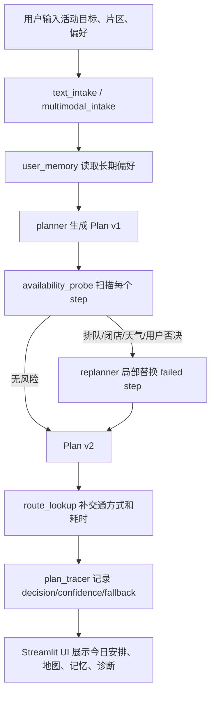
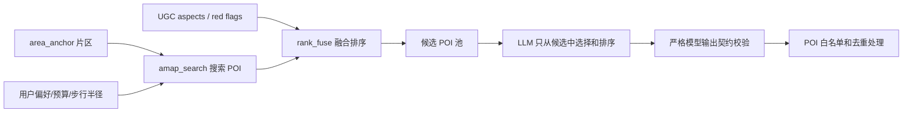
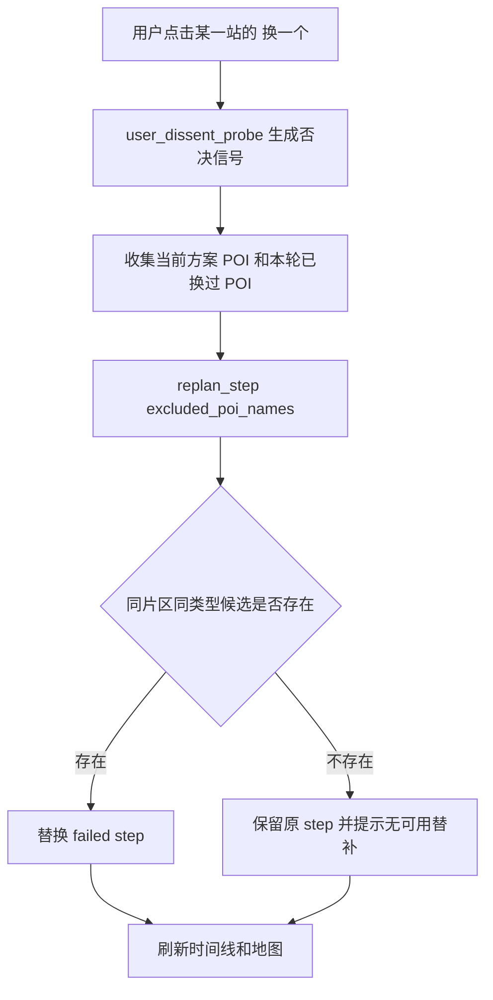
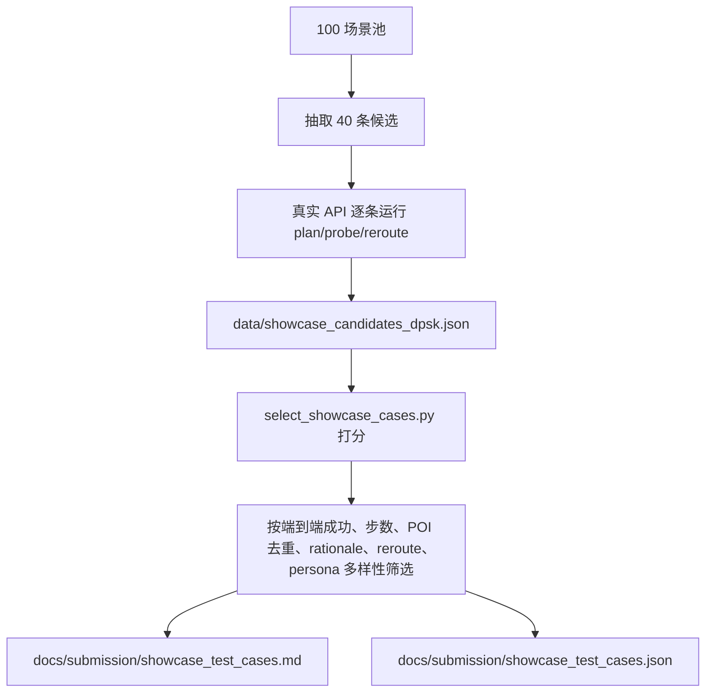
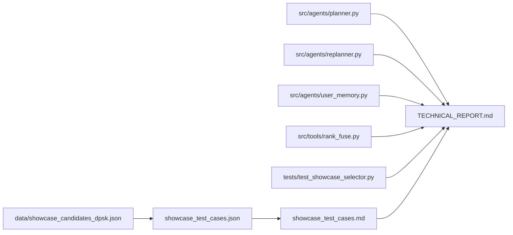

# BJ-Pal 流程图

## 1. 主运行链路

```mermaid
flowchart TD
    A[用户输入活动目标、片区、偏好] --> B[text_intake / multimodal_intake]
    B --> C[user_memory 读取长期偏好]
    C --> D[planner 生成 Plan v1]
    D --> E[availability_probe 扫描每个 step]
    E -->|无风险| H[Plan v2]
    E -->|排队/闭店/天气/用户否决| F[replanner 局部替换 failed step]
    F --> H
    H --> I[route_lookup 补交通方式和耗时]
    I --> J[plan_tracer 记录 decision/confidence/fallback]
    J --> K[Streamlit UI 展示今日安排、地图、记忆、诊断]
```

## 2. 候选池约束链路

```mermaid
flowchart LR
    A[area_anchor 片区] --> B[amap_search 搜索 POI]
    C[用户偏好/预算/步行半径] --> B
    D[UGC aspects / red flags] --> E[rank_fuse 融合排序]
    B --> E
    E --> F[候选 POI 池]
    F --> G[LLM 只从候选中选择和排序]
    G --> H[严格模型输出契约校验]
    H --> I[POI 白名单和去重处理]
```

## 3. 点击“换一个”链路

```mermaid
flowchart TD
    A[用户点击某一站的 换一个] --> B[user_dissent_probe 生成否决信号]
    B --> C[收集当前方案 POI 和本轮已换过 POI]
    C --> D[replan_step excluded_poi_names]
    D --> E{同片区同类型候选是否存在}
    E -->|存在| F[替换 failed step]
    E -->|不存在| G[保留原 step 并提示无可用替补]
    F --> H[刷新时间线和地图]
    G --> H
```

## 4. 展示案例筛选链路

```mermaid
flowchart TD
    A[100 场景池] --> B[抽取 40 条候选]
    B --> C[真实 API 逐条运行 plan/probe/reroute]
    C --> D[data/showcase_candidates_dpsk.json]
    D --> E[select_showcase_cases.py 打分]
    E --> F[按端到端成功、步数、POI 去重、rationale、reroute、persona 多样性筛选]
    F --> G[docs/submission/showcase_test_cases.md]
    F --> H[docs/submission/showcase_test_cases.json]
```

## 5. 文件和证据关系

```mermaid
flowchart LR
    A[src/agents/planner.py] --> R[TECHNICAL_REPORT.md]
    B[src/agents/replanner.py] --> R
    C[src/agents/user_memory.py] --> R
    D[src/tools/rank_fuse.py] --> R
    E[tests/test_showcase_selector.py] --> R
    F[data/showcase_candidates_dpsk.json] --> G[showcase_test_cases.json]
    G --> H[showcase_test_cases.md]
    H --> R
```
