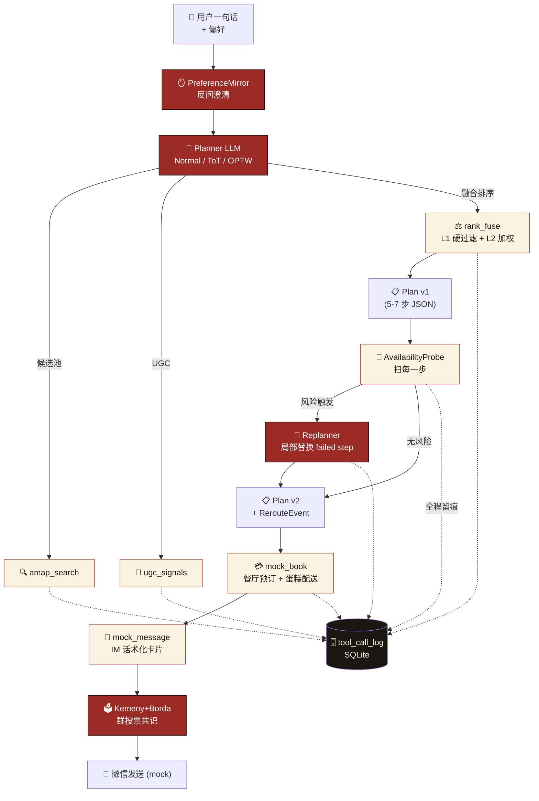
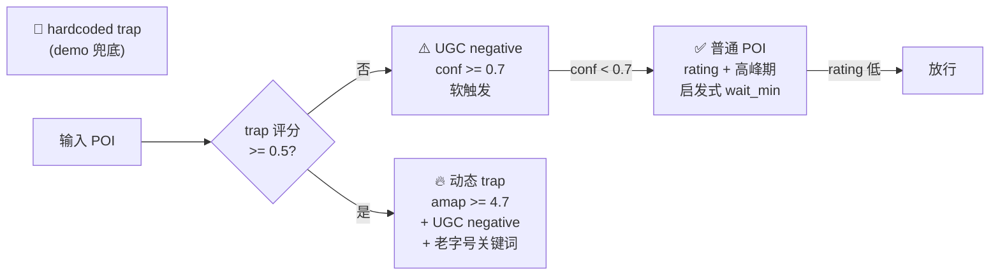
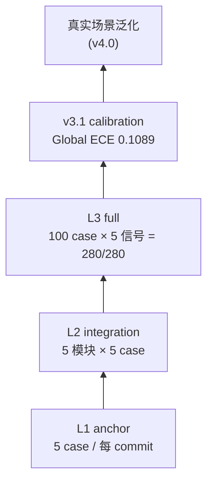

# BJ-Pal 系统架构图

> 文本源真相，GitHub / Notion 等 markdown 渲染器都支持 mermaid。
> 用作 README、Wiki、文档插图。

## 整体流水线（Plan-and-Execute + Probe + Replan）



## L2 Ranking 公式

```
score = 0.35 · amap_rating
      + 0.30 · ugc_soft⁺
      + 0.15 · budget_fit
      + 0.10 · distance
      + 0.10 · crowd_penalty

ugc_soft⁺ = Σ (sign · confidence · 2 · weekend_afternoon_intensity)
```

每条候选附 `reasons[(factor, contrib, evidence)]`，evidence 直接引 UGC 原文。

## 异常处理三层



## 数据资产

| 资产 | 数量 | 来源 |
|---|---|---|
| 北京 POI | 5,656 | 高德地图 |
| UGC aspects | 8,666 | 大众点评 + 小红书 + 公开摘要结构化 |
| POI 信号网 | 5,198 | parking / seasonal / crowd / facility |
| AI 用户访谈 | 100 | 自建 ai-user-research-platform |
| 预爬 routes | 1,892 | 高德路径规划 + estimated_v2 |

## 评测金字塔



## v3.1 黑客松展示点

- **ToT / OPTW / Kemeny+Borda**：复杂约束、全局最优路线、群体共识三条算法线。
- **plan_tracer + OTel trace**：每一步 `(decision, confidence, fallback)` 可回放。
- **ECE 0.1089**：不是只说“可信”，而是用校准指标量化可信度。
